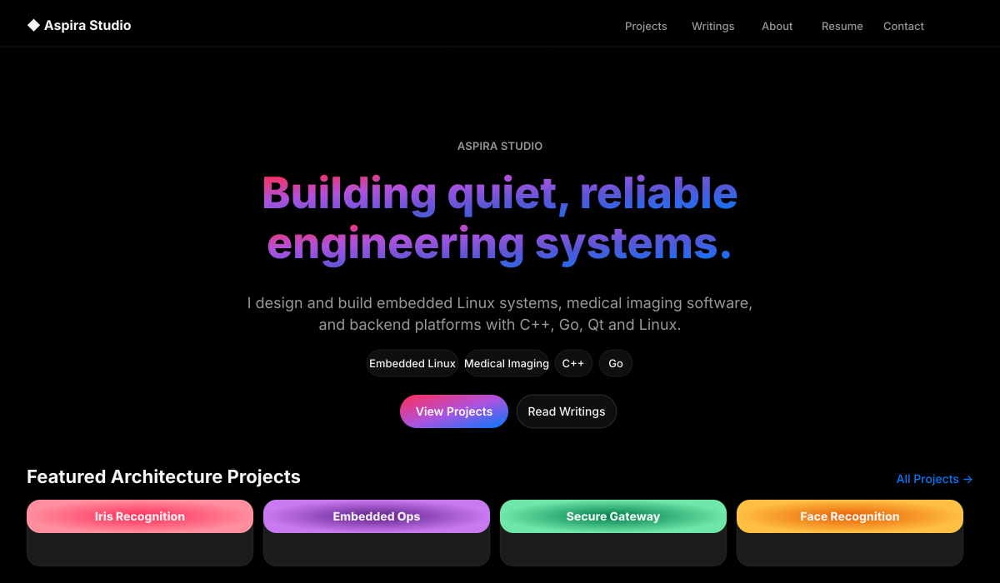
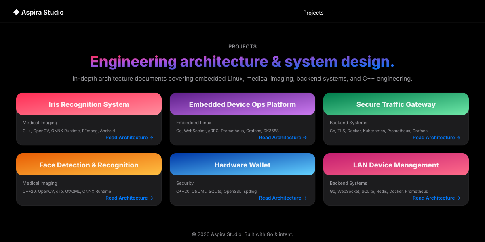

<div align="center">



</div>

<br>

<p align="center">
  <strong>C++ · Go · Qt/QML · Embedded Linux · AI Inference · Network Systems</strong>
</p>

<p align="center">
  <sub>Personal engineering repository — embedded systems, medical imaging, backend platforms, and system architecture.</sub>
</p>

---

<br>

## ◈ Tech Stack

<table>
<tr>
<td>

| — | — |
|---|---|
| **Languages** | `C++20` `C++17` `Go` `Python` `Shell` |
| **Systems** | `Ubuntu/Debian` `Yocto` `Buildroot` |
| **Platforms** | `RK3568` `RK3588` `Jetson` `ARM` `x86-64` |
| **Frameworks** | `Qt 5.15` `QML` `Gin` `Vue 3` `ONNX Runtime` |

</td>
<td>

| — | — |
|---|---|
| **AI/ML** | `YOLOv5/v8` `ONNX` `OpenCV` `dlib` `PyTorch` |
| **Storage** | `PostgreSQL` `SQLite` `Redis` |
| **Infra** | `Docker` `Prometheus` `Grafana` `Kubernetes` |
| **Tools** | `CMake` `Git` `GTest` `spdlog` `OpenSSL` |

</td>
</tr>
</table>

---

<br>

## ◈ Portfolio Site &nbsp; `live at localhost:8080`

<p>
  <a href="projects/portfolio-site/"><strong>Aspira Studio</strong></a> — a personal portfolio website with Apple Music-inspired dark theme.
</p>

<p align="center">
  
</p>

<p align="center">
  <em>Gradient hero · Glass morphism header · Dark mode · 9 gradient cover cards</em>
</p>

<p align="center">
  
</p>

<p align="center">
  <em>9 architecture documents imported as project pages with unique Apple Music-style gradient covers</em>
</p>

### Features

| — | — |
|---|---|
| **Design** | Apple Music dark theme with 9 unique gradient palettes |
| **Backend** | Go 1.22, SQLite, structured JSON logging |
| **Frontend** | Server-rendered HTML templates, CSS glass morphism |
| **Projects** | 9 architecture documents (`Medical Imaging`, `Embedded Linux`, `Backend Systems`, `Security`) |
| **Admin** | Dashboard, article CRUD, statistics, audit logs |
| **Security** | CSRF protection, rate limiting, JWT session auth |
| **Pages** | Home · Projects · Project Detail · Writings · About · Resume · Contact |

### Project Pages

<table>
<tr>
<td width="33%">

 **Hot Pink → Coral**  
`Iris Recognition`  
Android Camera Streaming

</td>
<td width="33%">

 **Deep Purple → Violet**  
`Embedded Ops Platform`  
Device Fleet Management

</td>
<td width="33%">

 **Emerald → Teal**  
`Secure Traffic Gateway`  
Multi-Node Proxy Grid

</td>
</tr>
<tr>
<td>

 **Tangerine → Amber**  
`Face Recognition`  
C++20 + dlib + OpenCV

</td>
<td>

 **Electric Blue → Cyan**  
`Hardware Wallet`  
Ed25519 + AES-256-GCM

</td>
<td>

 **Magenta → Orchid**  
`LAN Device Manager`  
ARP/mDNS Discovery

</td>
</tr>
<tr>
<td>

 **Gold → Sunset**  
`RK3568 Wallet`  
Anti-brute-force Security

</td>
<td>

 **Indigo → Periwinkle**  
`Neural Iris Recognition`  
ONNX + TensorRT + RKNN

</td>
<td>

 **Crimson → Fuchsia**  
`Traffic Lab Proxy`  
Token Bucket Rate Limiting

</td>
</tr>
</table>

> **Live Demo:** Server running at `http://localhost:8080` — [projects/portfolio-site/](projects/portfolio-site/)

---

<br>

## ◈ Projects

### Go Backend Services

<table>
<tr>
<td width="50%">

#### 🔌 [lan-monitor](projects/lan-monitor/)
**LAN Device Monitor**  
Periodic ARP/Ping/TCP LAN scanning · WebSocket real-time push · ECharts visualization · RBAC + audit logging  
`Go` `Gin` `SQLite` `JWT` `WebSocket` `Docker`

</td>
<td width="50%">

#### 📡 [embedded-ops-platform](projects/embedded-ops-platform/)
**Embedded Device Ops**  
Agent auto-registration · Heartbeat monitoring · CPU/GPU/temp metrics · Whitelist remote commands · Vue 3 dashboard  
`Go` `PostgreSQL` `Redis` `WebSocket` `JWT+HMAC` `Vue 3` `Docker`

</td>
</tr>
<tr>
<td>

#### 🛡️ [secure-gateway](projects/secure-gateway/)
**Secure Traffic Gateway**  
Control/data plane separation · TLS encryption · Load balancing · Prometheus metrics · Node health checking  
`Go` `PostgreSQL` `Redis` `JWT` `Vue 3` `Docker Compose`

</td>
<td>

#### 🚦 [traffic_lab_proxy](projects/traffic_lab_proxy/)
**Traffic Scheduling Lab**  
Token Bucket rate limiting · Multi-strategy load balancing · Node heartbeat + failover · Prometheus + Grafana  
`Go` `SQLite` `Prometheus` `Grafana` `Docker Compose`

</td>
</tr>
</table>

### C++ Embedded & Desktop

<table>
<tr>
<td width="50%">

#### 💰 [hardware-wallet](projects/hardware-wallet/)
**RK3568 Crypto Wallet**  
KEK/DEK layered encryption · Ed25519 key pairs · BIP39 mnemonics · AES-GCM backup · 3-fail self-destruct · Repository-Service-ViewModel  
`C++20` `Qt 5.15` `QML` `OpenSSL` `libsodium` `SQLite` `spdlog`

</td>
<td width="50%">

#### 🔑 [embedded_hardware_wallet](projects/embedded_hardware_wallet/)
**ARM Hardware Wallet**  
ECC key management · Encrypted secure storage · Shamir Secret Sharing backup · TrustZone/Secure Enclave · QML UI  
`C++20` `Qt 5.15` `QML` `OpenSSL`

</td>
</tr>
<tr>
<td>

#### 👁️ [iris_recognition_system](projects/iris_recognition_system/)
**Iris Recognition Pipeline**  
Capture → Detection → Quality → Segmentation → Normalization → Feature Extraction → Liveness → Match · ONNX/RKNN/TensorRT  
`C++20` `OpenCV` `ONNX Runtime` `OpenSSL`

</td>
<td>

#### 😊 [embedded_face_recognition](projects/embedded_face_recognition/)
**Face Recognition**  
HOG/CNN detection · dlib 128-D embeddings · Multi-threaded pipeline (RingBuffer + ThreadPool) · Camera/video/image input  
`C++20` `OpenCV` `dlib`

</td>
</tr>
<tr>
<td>

#### 🩻 [ultrasound_system](projects/ultrasound_system/)
**Ultrasound Imaging**  
B/M/Color/PW/Triplex simulation · Probe detection · Cine replay · DICOM/PACS export · Patient registration  
`C++17` `Qt 5.15` `QML` `Quick Controls 2`

</td>
<td>

#### 🔬 [ultrasound_software_project](projects/ultrasound_software_project/)
**Ultrasound Software (Early Iteration)**  
Image processing · Memory pool · Thread pool · B-mode generation · Parameter management  
`C++20` `Qt 5.15` `QML`

</td>
</tr>
</table>

### AI Inference

<table>
<tr>
<td>

#### 🤖 [yolo_cpp](projects/yolo_cpp/)
**YOLOv8 C++ Segmentation**  
ONNX Runtime inference · PH2 skin lesion dataset · Multi-threaded postprocessing · OpenCV preprocessing  
`C++20` `ONNX Runtime 1.18` `OpenCV` `YOLOv8` `Python/PyTorch`

</td>
</tr>
</table>

### Embedded Linux

<table>
<tr>
<td width="50%">

#### 📶 [aic8800-driver](embedded/linux/aic8800-driver/)
**AIC8800 WiFi 6 Driver**  
Precompiled kernel modules · Firmware · Udev rules · Debian 12 + LB-LINK BL-WN300AX  
`Linux Kernel` `ARM` `Cross-compile`

</td>
<td width="50%">

#### 🐳 [aic8800-deploy](embedded/linux/aic8800-deploy/)
**AIC8800 Deploy Package**  
One-click deploy script · .ko modules · Firmware files · Udev configuration  
`Shell` `Linux`

</td>
</tr>
</table>

---

<br>

## ◈ Architecture Documents

The following design documents map to code implementations and serve as the 9 projects in the [portfolio site](#-portfolio-site--live-at-localhost8080):

<table>
<tr><th>Document</th><th>Code</th><th>Category</th></tr>
<tr><td><a href="projects/go_lan_device_web_system_architecture.md">LAN Device Web System</a></td><td><a href="projects/lan-monitor/">lan-monitor</a></td><td>Backend Systems</td></tr>
<tr><td><a href="projects/distributed_embedded_web_ops_platform_design.md">Embedded Device Ops Platform</a></td><td><a href="projects/embedded-ops-platform/">embedded-ops-platform</a></td><td>Embedded Linux</td></tr>
<tr><td><a href="projects/distributed_secure_traffic_gateway_design.md">Secure Traffic Gateway</a></td><td><a href="projects/secure-gateway/">secure-gateway</a></td><td>Backend Systems</td></tr>
<tr><td><a href="projects/traffic_lab_proxy_architecture.md">Traffic Lab Proxy</a></td><td><a href="projects/traffic_lab_proxy/">traffic_lab_proxy</a></td><td>Backend Systems</td></tr>
<tr><td><a href="projects/hardware_wallet_architecture.md">RK3568 Hardware Wallet</a></td><td><a href="projects/hardware-wallet/">hardware-wallet</a></td><td>Security</td></tr>
<tr><td><a href="projects/embedded_hardware_wallet_architecture.md">ARM Embedded Wallet</a></td><td><a href="projects/embedded_hardware_wallet/">embedded_hardware_wallet</a></td><td>Security</td></tr>
<tr><td><a href="projects/iris_recognition_cpp_nn_architecture.md">Iris Recognition NN System</a></td><td><a href="projects/iris_recognition_system/">iris_recognition_system</a></td><td>Medical Imaging</td></tr>
<tr><td><a href="projects/embedded_face_recognition_architecture.md">Face Recognition System</a></td><td><a href="projects/embedded_face_recognition/">embedded_face_recognition</a></td><td>Medical Imaging</td></tr>
<tr><td><a href="projects/android_iris_camera_architecture.md">Android Iris Camera</a></td><td>—</td><td>Medical Imaging</td></tr>
<tr><td><a href="projects/minimal_portfolio_architecture.md">Portfolio Site Design</a></td><td><a href="projects/portfolio-site/">portfolio-site</a></td><td>Backend Systems</td></tr>
</table>

---

<br>

## ◈ Foundations

| Directory | Content |
|-----------|---------|
| [cpp_basic/algorithm](cpp_basic/algorithm/) | Algorithms — sorting, DP, graph |
| [cpp_basic/basic](cpp_basic/basic/) | C++ fundamentals — smart pointers, templates, thread pool, memory pool |
| [cpp_basic/notes](cpp_basic/notes/) | C/C++ notes — struct layout, memory model |
| [dl_basic](dl_basic/) | Deep learning intro — PyTorch, FCN, U-Net |
| [imaging/basic](imaging/basic/) | Image processing — OpenCV face detection, segmentation, QR code |
| [embedded/kernel](embedded/kernel/) | Kernel build notes |

---

<br>

## ◈ Stats

```
  Projects      18+    (code + docs)
  Go services    4     (lan-monitor, ops-platform, gateway, proxy)
  C++ projects   7     (wallet ×2, iris, face, ultrasound ×2, yolo)
  Design docs   10     (.md architecture specifications)
  Portfolio      9     (English architecture pages on Aspira Studio)
```

---

<br>

<p align="center">
  <sub>Contact · <a href="https://github.com/norway216">@norway216</a></sub>
</p>

<p align="center">
  <sub>Continuous updates · 2024–2026</sub>
</p>
