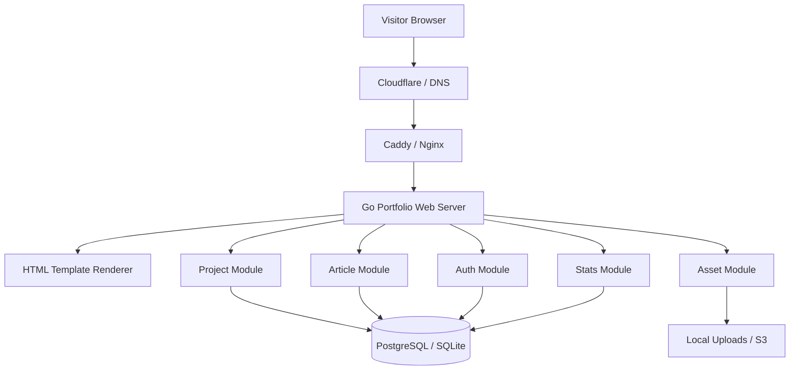
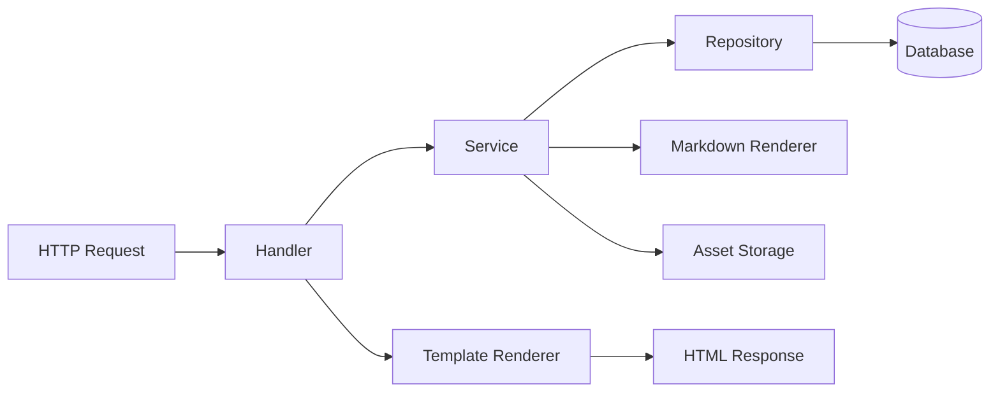
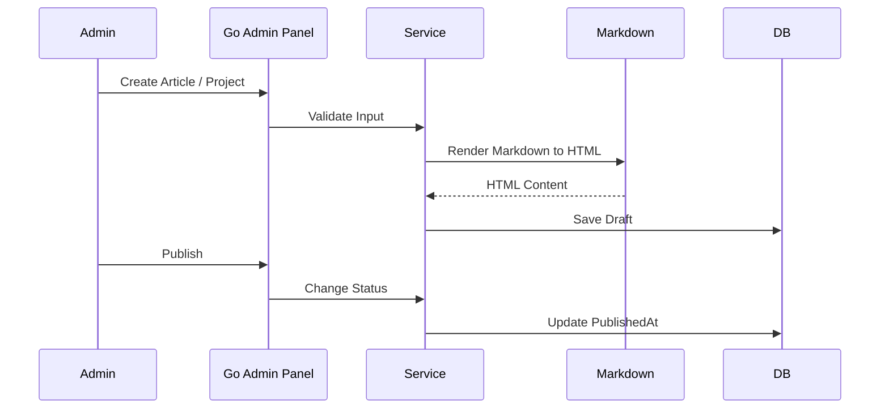
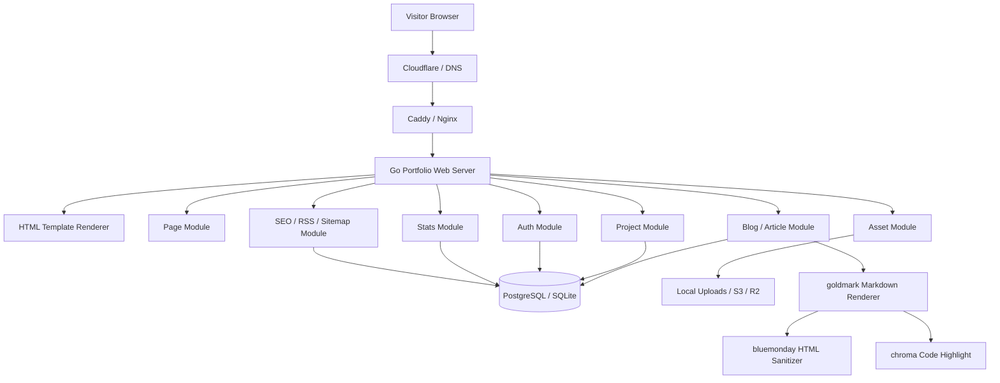
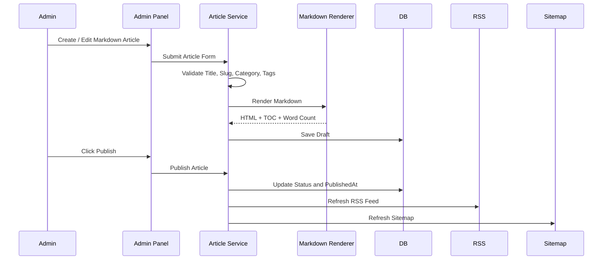

# Go 语言简约日式个人作品集网站架构设计文档

> 文档定位：用于设计并实现一个以 Go 语言为核心后端的个人作品展示网站。  
> 风格定位：简约、留白、日式、安静、专业、工程感。  
> 适用对象：嵌入式 Linux / C++ / Go / 医疗影像 / 系统工程方向的个人技术品牌网站。

---

## 1. 项目背景

你希望建设一个用于展示个人作品、技术文章、工程能力和职业方向的网站。这个网站不应该只是普通博客，也不应该只是简历页面，而应该是一个具有明确技术定位的个人作品集系统。

网站需要体现以下特征：

1. 使用 Go 语言设计并实现。
2. 以个人工程作品展示为核心。
3. 支持项目详情、技术文章、个人介绍、简历、联系方式。
4. 风格简约、日式、有留白、有秩序感。
5. 后续可扩展为个人技术品牌站点，例如 Aspira Studio。
6. 后台可以管理项目、文章、图片、标签、简历信息。
7. 前台访问速度快，SEO 友好，适合给招聘方、合作方、海外公司查看。

---

## 2. 网站整体定位

### 2.1 网站名称建议

可以选择以下名称：

| 名称 | 适合程度 | 说明 |
|---|---:|---|
| Aspira Studio | ★★★★★ | 更像个人技术品牌，未来可扩展 |
| Meng Yan Portfolio | ★★★★☆ | 直接、清晰，适合求职 |
| Aspira Engineering | ★★★★☆ | 工程感强，适合技术路线 |
| mengyan.dev | ★★★★★ | 适合个人开发者域名 |
| aspira.dev | ★★★★★ | 品牌感更强 |

推荐主标题：

```text
Aspira Studio
```

推荐副标题：

```text
Embedded Linux · Medical Imaging · C++ · Go
```

中文副标题：

```text
嵌入式 Linux · 医疗影像软件 · C++ · Go 后端系统
```

---

## 3. 网站风格设计

## 3.1 设计关键词

```text
Minimal / Japanese / Calm / Clean / Engineering / White Space / Craftsmanship
```

中文理解：

```text
简约 / 日式 / 安静 / 留白 / 工程感 / 克制 / 职人感
```

这个网站不要追求复杂动效，也不要做成花哨的前端作品集。更适合采用“日本设计 + 工程文档 + 技术作品集”的混合风格。

---

## 3.2 视觉风格原则

### 3.2.1 留白优先

页面不要塞满内容。每一个模块之间要有足够间距。

推荐布局：

```text
宽屏页面最大宽度：1080px ~ 1200px
正文最大宽度：720px ~ 860px
模块上下间距：80px ~ 120px
卡片内边距：24px ~ 40px
```

### 3.2.2 色彩克制

推荐使用低饱和色。

| 用途 | 颜色 | 说明 |
|---|---|---|
| 主背景 | #F7F3EA | 米白色，类似和纸 |
| 内容背景 | #FFFFFF | 干净白色 |
| 主文字 | #1F2933 | 深灰黑 |
| 次级文字 | #6B7280 | 柔和灰 |
| 边框 | #E5E1D8 | 米灰色 |
| 强调色 | #B45309 | 枯山水/木色系 |
| 辅助强调 | #2F5D50 | 深绿色，日式庭院感 |
| 代码背景 | #F3F0E8 | 浅米灰 |

### 3.2.3 字体建议

中文字体：

```text
Noto Sans SC
Source Han Sans SC
霞鹜文楷 LXGW WenKai，可用于少量标题
```

英文与代码：

```text
Inter
IBM Plex Sans
JetBrains Mono
Source Code Pro
```

推荐组合：

```text
标题：Noto Serif SC / Source Han Serif SC
正文：Noto Sans SC / Inter
代码：JetBrains Mono
```

日式风格不一定要用日文字体，更重要的是留白、克制、秩序感。

---

## 3.3 页面视觉参考方向

可参考以下类型的网站，不一定完全照搬：

| 类型 | 可参考点 |
|---|---|
| 日本设计工作室官网 | 留白、排版、极简导航 |
| Muji 风格页面 | 克制、自然色、产品感 |
| Notion 风格页面 | 清晰信息结构 |
| Linear 风格页面 | 简洁工程感 |
| 技术文档站 | 内容可读性、代码展示 |
| 开发者 Portfolio | 项目卡片、技术栈、联系方式 |

---

# 4. 网站信息架构

## 4.1 前台页面结构

```text
/
├── 首页 Home
├── 作品 Projects
│   ├── 局域网设备检测系统
│   ├── 嵌入式设备运维平台
│   ├── RK3588 医疗影像性能优化
│   ├── 嵌入式 Linux 镜像定制
│   └── 轻量级 AddressSanitizer
├── 文章 Writings
│   ├── Go 后端系统设计
│   ├── 嵌入式 Linux 调试
│   ├── C++ 性能优化
│   └── 医疗影像软件工程
├── 关于 About
├── 简历 Resume
├── 联系 Contact
└── 管理后台 Admin
```

---

## 4.2 首页结构

首页建议只展示最重要的信息。

```text
首页 Home
├── Hero 首屏介绍
├── Selected Projects 精选项目
├── Engineering Focus 技术方向
├── Latest Writings 最新文章
├── About Preview 简短介绍
└── Contact CTA 联系入口
```

### 4.2.1 Hero 区域

内容示例：

```text
Aspira Studio

I build reliable embedded systems, medical imaging software,
and backend platforms with C++, Go, Linux and Qt.

Embedded Linux · Medical Imaging · C++ · Go

[View Projects] [Read Articles] [Download Resume]
```

中文版本：

```text
Aspira Studio

我专注于嵌入式 Linux、医疗影像软件、高性能 C++、Go 后端系统与工程化平台设计。

嵌入式 Linux · 医疗影像软件 · C++ · Go

[查看作品] [技术文章] [下载简历]
```

---

## 4.3 作品列表页

作品页以卡片形式展示项目。

每个项目卡片包含：

```text
项目名称
一句话简介
技术栈标签
项目状态
项目类型
项目封面图
查看详情按钮
GitHub 链接
Demo 链接，可选
```

项目类型建议：

| 类型 | 示例 |
|---|---|
| Backend System | Go 局域网设备管理系统 |
| Embedded Linux | RK3588 镜像定制 |
| Medical Imaging | 超声图像性能优化 |
| C++ Runtime | 轻量级 ASan |
| Web Platform | 个人作品集网站 |

---

## 4.4 项目详情页

每个项目详情页采用案例分析结构，而不是简单介绍。

```text
项目详情页
├── 项目标题
├── 项目摘要
├── 技术栈
├── 项目背景
├── 核心功能
├── 系统架构图
├── 技术难点
├── 解决方案
├── 数据库设计
├── 核心代码片段
├── 性能指标
├── 页面截图
├── 项目收获
└── 后续计划
```

---

## 4.5 技术文章页

文章页类似技术博客，但风格保持简约。

文章分类建议：

```text
Embedded Linux
Go Backend
C++ Engineering
Medical Imaging
System Design
Performance
Career Notes
```

文章详情页结构：

```text
标题
发布时间
分类
标签
摘要
目录
正文
代码块
图片
参考链接
上一篇 / 下一篇
```

---

## 4.6 关于页面

关于页面要突出个人定位，而不是写流水账。

推荐结构：

```text
About
├── 我是谁
├── 我的技术方向
├── 我解决过的问题
├── 我正在学习什么
├── 我的长期方向
└── 联系方式
```

示例文案：

```text
I am a software engineer focused on embedded Linux, medical imaging software,
and backend system design. My work connects low-level system debugging,
C++ performance engineering, and Go-based web platforms.
```

中文：

```text
我是一名专注于嵌入式 Linux、医疗影像软件和后端系统设计的软件工程师。
我的工作连接底层系统调试、C++ 性能优化、Qt/OpenGL 图像软件和 Go Web 平台设计。
```

---

## 4.7 简历页面

简历页建议支持 PDF 下载。

内容结构：

```text
Resume
├── 基本信息
├── 技术栈
├── 工作经历
├── 项目经历
├── 教育经历
├── 语言能力
└── 下载 PDF 简历
```

---

# 5. 系统总体架构

## 5.1 架构目标

系统目标：

1. 前台访问速度快。
2. 后台管理简单可靠。
3. 内容可维护。
4. Go 后端结构清晰。
5. 易于部署到 VPS 或云服务器。
6. 后续可以扩展评论、访问统计、英文版、RSS。

---

## 5.2 推荐架构

```text
Browser
  |
  | HTTPS
  v
Nginx / Caddy
  |
  v
Go Web Server
  |
  ├── HTML Template Renderer
  ├── REST API
  ├── Admin Panel
  ├── Auth Middleware
  ├── Project Service
  ├── Article Service
  ├── Asset Service
  └── Resume Service
  |
  ├── PostgreSQL / SQLite
  ├── Redis，可选
  └── Local Object Storage / S3，可选
```

---

## 5.3 单体优先架构

个人作品集网站不建议一开始就做微服务。推荐使用 Go 单体架构。

原因：

1. 功能边界清晰。
2. 部署简单。
3. 维护成本低。
4. 个人项目更适合快速迭代。
5. 后续可以按模块拆分。

推荐模式：

```text
Modular Monolith
```

也就是：

```text
一个 Go 程序
多个内部模块
清晰分层
统一部署
```

---

# 6. 技术选型

## 6.1 后端技术栈

| 模块 | 推荐技术 | 说明 |
|---|---|---|
| 语言 | Go 1.22+ | 核心开发语言 |
| Web 框架 | Gin / Echo / Chi | 推荐 Chi 或 Gin |
| 模板引擎 | html/template / templ | 服务端渲染 |
| ORM | GORM / SQLC | 简单场景用 GORM，严谨场景用 SQLC |
| 数据库 | SQLite / PostgreSQL | 初期 SQLite，正式部署 PostgreSQL |
| 缓存 | Redis | 可选，用于访问统计和热点缓存 |
| 配置 | Viper / envconfig | 管理配置 |
| 日志 | slog / zap | 推荐 Go 标准库 slog |
| 鉴权 | Session + Cookie / JWT | 后台管理用 Session 更简单 |
| 文件上传 | 本地存储 / MinIO / S3 | 初期本地即可 |
| Markdown | goldmark | 渲染技术文章 |
| 部署 | Docker + Caddy/Nginx | 便于迁移 |

---

## 6.2 前端技术栈

这个网站可以采用两种实现路线。

### 路线 A：Go 服务端渲染，推荐

```text
Go + html/template + HTMX + Alpine.js + Tailwind CSS
```

优点：

1. Go 参与度高。
2. 架构简单。
3. SEO 友好。
4. 访问速度快。
5. 不需要复杂前端工程。
6. 很适合简约日式风格网站。

### 路线 B：前后端分离

```text
Go API + Vue3 / React / Svelte
```

优点：

1. 交互更强。
2. 后台管理更容易做成 SPA。
3. 适合以后扩展复杂功能。

缺点：

1. 项目复杂度更高。
2. 部署链路更长。
3. 对作品集网站来说略重。

最终推荐：

```text
前台：Go SSR + Tailwind CSS + 少量 HTMX
后台：Go SSR 或 Vue3 Admin
```

如果追求整体简单，后台也可以用 Go SSR 实现。

---

## 6.3 数据库选择

### 开发阶段

```text
SQLite
```

优点：

1. 无需安装数据库服务。
2. 备份简单。
3. 适合个人网站。

### 正式阶段

```text
PostgreSQL
```

优点：

1. 稳定。
2. 查询能力强。
3. 适合后续扩展。
4. 支持全文搜索。

推荐策略：

```text
Repository 层屏蔽数据库差异，开发使用 SQLite，部署使用 PostgreSQL。
```

---

# 7. 后端分层架构

## 7.1 分层模型

```text
HTTP Layer
  ↓
Handler Layer
  ↓
Service Layer
  ↓
Repository Layer
  ↓
Database Layer
```

### 7.1.1 Handler 层

负责：

```text
HTTP 请求解析
参数校验
调用 Service
返回 HTML 或 JSON
错误处理
```

### 7.1.2 Service 层

负责：

```text
业务逻辑
权限判断
状态流转
数据组装
缓存策略
```

### 7.1.3 Repository 层

负责：

```text
数据库读写
SQL 封装
事务处理
数据查询
```

### 7.1.4 Model 层

负责：

```text
数据结构定义
DTO 定义
表结构映射
```

---

## 7.2 后端目录结构

推荐目录：

```text
portfolio-site/
├── cmd/
│   └── server/
│       └── main.go
├── internal/
│   ├── app/
│   │   ├── app.go
│   │   └── router.go
│   ├── config/
│   │   └── config.go
│   ├── middleware/
│   │   ├── auth.go
│   │   ├── logger.go
│   │   ├── recovery.go
│   │   └── csrf.go
│   ├── module/
│   │   ├── project/
│   │   │   ├── handler.go
│   │   │   ├── service.go
│   │   │   ├── repository.go
│   │   │   ├── model.go
│   │   │   └── dto.go
│   │   ├── article/
│   │   │   ├── handler.go
│   │   │   ├── service.go
│   │   │   ├── repository.go
│   │   │   ├── model.go
│   │   │   └── markdown.go
│   │   ├── auth/
│   │   │   ├── handler.go
│   │   │   ├── service.go
│   │   │   └── model.go
│   │   ├── asset/
│   │   │   ├── handler.go
│   │   │   ├── service.go
│   │   │   └── storage.go
│   │   ├── page/
│   │   │   ├── handler.go
│   │   │   └── service.go
│   │   └── stats/
│   │       ├── handler.go
│   │       ├── service.go
│   │       └── repository.go
│   ├── render/
│   │   ├── template.go
│   │   └── viewmodel.go
│   ├── database/
│   │   ├── db.go
│   │   └── migration.go
│   └── util/
│       ├── slug.go
│       ├── time.go
│       └── validator.go
├── web/
│   ├── templates/
│   │   ├── layout/
│   │   │   ├── base.html
│   │   │   ├── header.html
│   │   │   └── footer.html
│   │   ├── pages/
│   │   │   ├── home.html
│   │   │   ├── projects.html
│   │   │   ├── project_detail.html
│   │   │   ├── articles.html
│   │   │   ├── article_detail.html
│   │   │   ├── about.html
│   │   │   ├── resume.html
│   │   │   └── contact.html
│   │   └── admin/
│   │       ├── login.html
│   │       ├── dashboard.html
│   │       ├── project_form.html
│   │       └── article_form.html
│   ├── static/
│   │   ├── css/
│   │   ├── js/
│   │   ├── images/
│   │   └── uploads/
│   └── assets/
│       └── input.css
├── migrations/
│   ├── 001_init.sql
│   ├── 002_create_projects.sql
│   ├── 003_create_articles.sql
│   └── 004_create_assets.sql
├── scripts/
│   ├── build.sh
│   ├── deploy.sh
│   └── backup.sh
├── docker/
│   ├── Dockerfile
│   └── docker-compose.yml
├── docs/
│   ├── architecture.md
│   └── api.md
├── go.mod
├── go.sum
├── Makefile
├── .env.example
└── README.md
```

---

# 8. 核心模块设计

## 8.1 页面模块 Page Module

负责普通页面渲染。

包括：

```text
首页
关于页面
简历页面
联系页面
错误页面
```

主要接口：

| 方法 | 路径 | 功能 |
|---|---|---|
| GET | / | 首页 |
| GET | /about | 关于 |
| GET | /resume | 简历 |
| GET | /contact | 联系 |

---

## 8.2 作品模块 Project Module

负责项目展示。

### 8.2.1 项目字段

```text
ID
Title
Slug
Summary
Description
CoverImage
TechStack
Category
Status
Featured
GitHubURL
DemoURL
ContentMarkdown
ContentHTML
SortOrder
CreatedAt
UpdatedAt
PublishedAt
```

### 8.2.2 项目状态

```text
Draft
Published
Archived
```

### 8.2.3 项目分类

```text
Embedded Linux
Medical Imaging
Go Backend
C++ Runtime
System Design
Web Platform
```

### 8.2.4 前台接口

| 方法 | 路径 | 功能 |
|---|---|---|
| GET | /projects | 项目列表 |
| GET | /projects/{slug} | 项目详情 |
| GET | /projects/category/{category} | 分类项目 |

### 8.2.5 后台接口

| 方法 | 路径 | 功能 |
|---|---|---|
| GET | /admin/projects | 项目管理列表 |
| GET | /admin/projects/new | 新建项目页面 |
| POST | /admin/projects | 创建项目 |
| GET | /admin/projects/{id}/edit | 编辑项目页面 |
| POST | /admin/projects/{id} | 更新项目 |
| POST | /admin/projects/{id}/delete | 删除项目 |
| POST | /admin/projects/{id}/publish | 发布项目 |

---

## 8.3 文章模块 Article Module

负责技术文章管理。

### 8.3.1 文章字段

```text
ID
Title
Slug
Summary
Category
Tags
CoverImage
ContentMarkdown
ContentHTML
ReadingTime
Status
ViewCount
CreatedAt
UpdatedAt
PublishedAt
```

### 8.3.2 文章分类

```text
Go Backend
Embedded Linux
C++ Engineering
Medical Imaging
Performance
System Design
Career
```

### 8.3.3 Markdown 渲染

推荐使用：

```text
goldmark
```

支持：

```text
标题
目录
代码高亮
表格
图片
链接
引用
任务列表
```

代码高亮可以使用：

```text
chroma
```

---

## 8.4 素材模块 Asset Module

负责图片、简历 PDF、项目截图等文件管理。

### 8.4.1 素材类型

```text
Project Cover
Project Screenshot
Article Cover
Resume PDF
Avatar
Logo
Architecture Diagram
```

### 8.4.2 存储方式

初期：

```text
web/static/uploads/
```

后期：

```text
S3 / Cloudflare R2 / MinIO
```

### 8.4.3 文件命名规范

```text
uploads/
├── projects/
│   ├── lan-device-manager-cover.webp
│   ├── rk3588-imaging-dashboard.webp
│   └── linux-image-packaging-flow.webp
├── articles/
│   └── go-lan-scanner-architecture.webp
├── resume/
│   └── mengyan_resume_2026.pdf
└── brand/
    ├── avatar.webp
    ├── logo.svg
    └── favicon.svg
```

---

## 8.5 用户与后台管理模块 Auth Module

个人作品集网站后台不需要复杂多用户系统，初期只需要管理员账户。

### 8.5.1 用户字段

```text
ID
Username
Email
PasswordHash
Role
LastLoginAt
CreatedAt
UpdatedAt
```

### 8.5.2 角色设计

```text
Admin
Editor
Viewer，可选
```

初期只有 Admin 即可。

### 8.5.3 鉴权方式

推荐：

```text
Session + HttpOnly Cookie
```

原因：

1. 后台是传统 Web 页面。
2. 比 JWT 更简单。
3. 更适合服务端渲染。
4. 安全性可控。

### 8.5.4 安全要求

```text
密码使用 bcrypt / argon2id 哈希
Cookie 设置 HttpOnly
Cookie 设置 Secure
启用 CSRF 防护
后台路径限流
登录失败次数限制
后台不暴露详细错误信息
```

---

## 8.6 访问统计模块 Stats Module

可以记录基础访问数据。

### 8.6.1 统计内容

```text
页面 PV
独立访客粗略统计
项目访问次数
文章阅读次数
来源 Referer
User-Agent
访问时间
```

### 8.6.2 隐私友好原则

不要过度采集用户信息。

建议不保存完整 IP，只保存哈希或截断后的 IP。

```text
192.168.1.123 -> 192.168.1.0/24
```

或者：

```text
hash(ip + salt)
```

---

# 9. 数据库设计

## 9.1 表结构概览

```text
users
projects
articles
tags
article_tags
project_tags
assets
site_settings
page_views
contacts
```

---

## 9.2 users 表

```sql
CREATE TABLE users (
    id BIGSERIAL PRIMARY KEY,
    username VARCHAR(64) NOT NULL UNIQUE,
    email VARCHAR(128) NOT NULL UNIQUE,
    password_hash TEXT NOT NULL,
    role VARCHAR(32) NOT NULL DEFAULT 'admin',
    last_login_at TIMESTAMP NULL,
    created_at TIMESTAMP NOT NULL DEFAULT CURRENT_TIMESTAMP,
    updated_at TIMESTAMP NOT NULL DEFAULT CURRENT_TIMESTAMP
);
```

---

## 9.3 projects 表

```sql
CREATE TABLE projects (
    id BIGSERIAL PRIMARY KEY,
    title VARCHAR(200) NOT NULL,
    slug VARCHAR(200) NOT NULL UNIQUE,
    summary TEXT NOT NULL,
    description TEXT,
    category VARCHAR(80),
    status VARCHAR(32) NOT NULL DEFAULT 'draft',
    cover_image TEXT,
    tech_stack TEXT,
    github_url TEXT,
    demo_url TEXT,
    content_markdown TEXT,
    content_html TEXT,
    featured BOOLEAN NOT NULL DEFAULT FALSE,
    sort_order INT NOT NULL DEFAULT 0,
    view_count BIGINT NOT NULL DEFAULT 0,
    published_at TIMESTAMP NULL,
    created_at TIMESTAMP NOT NULL DEFAULT CURRENT_TIMESTAMP,
    updated_at TIMESTAMP NOT NULL DEFAULT CURRENT_TIMESTAMP
);
```

说明：

```text
tech_stack 可以先用逗号分隔字符串，后续再拆成关联表。
```

---

## 9.4 articles 表

```sql
CREATE TABLE articles (
    id BIGSERIAL PRIMARY KEY,
    title VARCHAR(200) NOT NULL,
    slug VARCHAR(200) NOT NULL UNIQUE,
    summary TEXT NOT NULL,
    category VARCHAR(80),
    status VARCHAR(32) NOT NULL DEFAULT 'draft',
    cover_image TEXT,
    content_markdown TEXT NOT NULL,
    content_html TEXT NOT NULL,
    reading_time INT NOT NULL DEFAULT 0,
    view_count BIGINT NOT NULL DEFAULT 0,
    published_at TIMESTAMP NULL,
    created_at TIMESTAMP NOT NULL DEFAULT CURRENT_TIMESTAMP,
    updated_at TIMESTAMP NOT NULL DEFAULT CURRENT_TIMESTAMP
);
```

---

## 9.5 tags 表

```sql
CREATE TABLE tags (
    id BIGSERIAL PRIMARY KEY,
    name VARCHAR(80) NOT NULL UNIQUE,
    slug VARCHAR(80) NOT NULL UNIQUE,
    created_at TIMESTAMP NOT NULL DEFAULT CURRENT_TIMESTAMP
);
```

---

## 9.6 article_tags 表

```sql
CREATE TABLE article_tags (
    article_id BIGINT NOT NULL REFERENCES articles(id) ON DELETE CASCADE,
    tag_id BIGINT NOT NULL REFERENCES tags(id) ON DELETE CASCADE,
    PRIMARY KEY (article_id, tag_id)
);
```

---

## 9.7 project_tags 表

```sql
CREATE TABLE project_tags (
    project_id BIGINT NOT NULL REFERENCES projects(id) ON DELETE CASCADE,
    tag_id BIGINT NOT NULL REFERENCES tags(id) ON DELETE CASCADE,
    PRIMARY KEY (project_id, tag_id)
);
```

---

## 9.8 assets 表

```sql
CREATE TABLE assets (
    id BIGSERIAL PRIMARY KEY,
    filename VARCHAR(255) NOT NULL,
    original_name VARCHAR(255),
    path TEXT NOT NULL,
    mime_type VARCHAR(128),
    size_bytes BIGINT NOT NULL DEFAULT 0,
    usage_type VARCHAR(64),
    alt_text TEXT,
    created_at TIMESTAMP NOT NULL DEFAULT CURRENT_TIMESTAMP
);
```

---

## 9.9 site_settings 表

```sql
CREATE TABLE site_settings (
    id BIGSERIAL PRIMARY KEY,
    key VARCHAR(128) NOT NULL UNIQUE,
    value TEXT,
    updated_at TIMESTAMP NOT NULL DEFAULT CURRENT_TIMESTAMP
);
```

可存储：

```text
site_title
site_subtitle
github_url
linkedin_url
email
resume_url
homepage_intro
```

---

## 9.10 page_views 表

```sql
CREATE TABLE page_views (
    id BIGSERIAL PRIMARY KEY,
    path TEXT NOT NULL,
    referrer TEXT,
    user_agent TEXT,
    ip_hash VARCHAR(128),
    created_at TIMESTAMP NOT NULL DEFAULT CURRENT_TIMESTAMP
);
```

---

## 9.11 contacts 表

```sql
CREATE TABLE contacts (
    id BIGSERIAL PRIMARY KEY,
    name VARCHAR(128),
    email VARCHAR(128),
    subject VARCHAR(255),
    message TEXT,
    status VARCHAR(32) NOT NULL DEFAULT 'new',
    created_at TIMESTAMP NOT NULL DEFAULT CURRENT_TIMESTAMP
);
```

---

# 10. 路由设计

## 10.1 前台路由

```text
GET /                       首页
GET /projects               项目列表
GET /projects/:slug         项目详情
GET /writings               文章列表
GET /writings/:slug         文章详情
GET /about                  关于我
GET /resume                 简历页面
GET /contact                联系页面
POST /contact               提交联系表单
GET /rss.xml                RSS 订阅
GET /sitemap.xml            站点地图
```

---

## 10.2 后台路由

```text
GET  /admin/login
POST /admin/login
POST /admin/logout

GET  /admin

GET  /admin/projects
GET  /admin/projects/new
POST /admin/projects
GET  /admin/projects/:id/edit
POST /admin/projects/:id
POST /admin/projects/:id/delete
POST /admin/projects/:id/publish

GET  /admin/articles
GET  /admin/articles/new
POST /admin/articles
GET  /admin/articles/:id/edit
POST /admin/articles/:id
POST /admin/articles/:id/delete
POST /admin/articles/:id/publish

GET  /admin/assets
POST /admin/assets/upload
POST /admin/assets/:id/delete

GET  /admin/settings
POST /admin/settings
```

---

## 10.3 API 路由，可选

如果后台使用 Vue3，可以增加 API：

```text
GET    /api/projects
POST   /api/projects
GET    /api/projects/:id
PUT    /api/projects/:id
DELETE /api/projects/:id

GET    /api/articles
POST   /api/articles
GET    /api/articles/:id
PUT    /api/articles/:id
DELETE /api/articles/:id

POST   /api/upload
GET    /api/stats/overview
```

---

# 11. 前端页面设计

## 11.1 页面布局

整体布局：

```text
Header
  Logo / Site Name
  Navigation
Main
  Page Content
Footer
  Copyright / Links
```

Header 示例：

```text
Aspira Studio        Projects  Writings  About  Resume  Contact
```

移动端：

```text
Aspira Studio        Menu
```

---

## 11.2 首页 Wireframe

```text
┌──────────────────────────────────────────────┐
│ Aspira Studio                    Navigation  │
├──────────────────────────────────────────────┤
│                                              │
│    Building quiet, reliable engineering       │
│    systems with C++, Go and Linux.            │
│                                              │
│    Embedded Linux · Medical Imaging · Go      │
│                                              │
│    [View Projects] [Read Writings]            │
│                                              │
├──────────────────────────────────────────────┤
│ Selected Projects                            │
│ ┌──────────────┐ ┌──────────────┐             │
│ │ Project Card │ │ Project Card │             │
│ └──────────────┘ └──────────────┘             │
│ ┌──────────────┐ ┌──────────────┐             │
│ │ Project Card │ │ Project Card │             │
│ └──────────────┘ └──────────────┘             │
├──────────────────────────────────────────────┤
│ Engineering Focus                            │
│ Embedded Linux / C++ / Go / Imaging           │
├──────────────────────────────────────────────┤
│ Latest Writings                              │
├──────────────────────────────────────────────┤
│ Footer                                       │
└──────────────────────────────────────────────┘
```

---

## 11.3 项目卡片设计

```text
┌─────────────────────────────────────┐
│ LAN Device Manager                  │
│                                     │
│ A Go-based web platform for LAN      │
│ device discovery, MAC tracking and   │
│ traffic visualization.               │
│                                     │
│ Go · PostgreSQL · Redis · ECharts    │
│                                     │
│ [Read Case Study]                    │
└─────────────────────────────────────┘
```

日式简约风的卡片不建议强阴影，建议：

```text
浅边框
圆角 12px
轻微背景色
Hover 时边框变深
```

---

## 11.4 项目详情页 Wireframe

```text
┌──────────────────────────────────────────────┐
│ Project                                      │
│ LAN Device Manager                           │
│ Go · PostgreSQL · Redis · ECharts            │
├──────────────────────────────────────────────┤
│ Overview                                     │
│ 项目简介                                     │
├──────────────────────────────────────────────┤
│ Background                                   │
│ 项目背景                                     │
├──────────────────────────────────────────────┤
│ Architecture                                 │
│ 架构图                                       │
├──────────────────────────────────────────────┤
│ Key Features                                 │
│ 功能列表                                     │
├──────────────────────────────────────────────┤
│ Technical Challenges                         │
│ 技术难点                                     │
├──────────────────────────────────────────────┤
│ Solution                                     │
│ 解决方案                                     │
├──────────────────────────────────────────────┤
│ Screenshots                                  │
│ 项目截图                                     │
└──────────────────────────────────────────────┘
```

---

# 12. 日式简约素材准备

## 12.1 必备素材清单

| 素材 | 用途 | 建议 |
|---|---|---|
| 个人头像 | About / 首页 | 简洁、自然、浅色背景 |
| Logo | Header / favicon | Aspira Studio 字标即可 |
| Favicon | 浏览器图标 | 使用 A 或圆形几何符号 |
| 项目封面图 | 项目卡片 | 每个项目 1 张 |
| 项目截图 | 详情页展示 | 每个项目 3~6 张 |
| 架构图 | 项目详情 | Mermaid 或手绘风格图 |
| 简历 PDF | Resume 页面 | 中英文各一份更好 |
| 背景纹理 | 页面质感 | 米白和纸纹理，可选 |
| 技术图标 | 技术栈展示 | Go、C++、Linux、Qt 等 |
| 文章封面 | 技术文章 | 简洁几何图即可 |

---

## 12.2 项目封面图建议

项目封面不一定要真实截图，也可以是简洁的信息图。

### 局域网设备管理系统

封面元素：

```text
网络节点
设备卡片
折线图
MAC / IP 文本
```

### RK3588 医疗影像优化

封面元素：

```text
芯片轮廓
超声图像波纹
性能曲线
GPU / CPU 字样
```

### 嵌入式 Linux 镜像定制

封面元素：

```text
Linux 终端
镜像文件
启动流程箭头
rootfs / boot / kernel
```

### 轻量级 AddressSanitizer

封面元素：

```text
内存块
红区 red zone
shadow memory
检测告警
```

---

## 12.3 图片风格要求

推荐：

```text
低饱和
浅色背景
线框图
几何图形
轻微纸张质感
不要复杂照片
不要强烈渐变
不要赛博朋克风
```

图片比例：

```text
项目封面：16:9
文章封面：16:9
头像：1:1
架构图：宽图，推荐 1200x700
```

---

## 12.4 文案素材准备

需要提前准备以下文字：

```text
个人一句话介绍
个人详细介绍
技术栈列表
每个项目的背景
每个项目的核心功能
每个项目的技术难点
每个项目的解决方案
每个项目的截图说明
简历 PDF
GitHub 地址
邮箱
LinkedIn，可选
```

---

# 13. 推荐展示的核心项目

## 13.1 局域网设备检测与运维管理系统

定位：Go 后端 + 网络管理 + 可视化。

展示内容：

```text
ARP / ICMP 扫描
MAC 地址识别
在线状态检测
在线时长统计
流量折线图
WebSocket 实时推送
用户权限管理
```

技术栈：

```text
Go / Gin / PostgreSQL / Redis / ECharts / WebSocket / Linux
```

---

## 13.2 嵌入式设备 Agent 运维平台

定位：分布式设备管理。

展示内容：

```text
Agent 自动注册
设备心跳
远程日志
系统资源采集
远程命令
告警机制
```

技术栈：

```text
Go / gRPC / WebSocket / SQLite / Linux / systemd
```

---

## 13.3 RK3588 医疗影像性能优化

定位：真实工程问题解决能力。

展示内容：

```text
超声 C 模式插帧卡顿分析
CPU / GPU 使用率分析
perf 火焰图
OpenGL 渲染链路
图像处理流水线优化
```

技术栈：

```text
C++ / Qt / OpenGL / Linux / RK3588 / perf
```

---

## 13.4 嵌入式 Linux 镜像定制

定位：系统工程能力。

展示内容：

```text
Yocto BSP 编译
rootfs 修改
ALSA 音量配置固化
USB WiFi 驱动与模式切换
WIC 镜像制作
启动流程分析
```

技术栈：

```text
Yocto / Debian / RK3588 / ALSA / systemd / Shell
```

---

## 13.5 轻量级 AddressSanitizer

定位：C/C++ 底层能力。

展示内容：

```text
影子内存设计
malloc/free hook
越界检测
use-after-free 检测
内存泄漏检测
运行时报告
```

技术栈：

```text
C / C++ / Linux / Runtime / Memory Debugging
```

---

# 14. Go 代码架构设计

## 14.1 main.go 设计

```go
package main

import (
    "context"
    "log/slog"
    "net/http"
    "os"
    "os/signal"
    "syscall"
    "time"

    "portfolio-site/internal/app"
    "portfolio-site/internal/config"
)

func main() {
    cfg := config.Load()
    logger := slog.New(slog.NewJSONHandler(os.Stdout, nil))

    application, err := app.New(cfg, logger)
    if err != nil {
        logger.Error("failed to create app", "error", err)
        os.Exit(1)
    }

    server := &http.Server{
        Addr:         cfg.Server.Addr,
        Handler:      application.Router(),
        ReadTimeout:  10 * time.Second,
        WriteTimeout: 10 * time.Second,
        IdleTimeout:  60 * time.Second,
    }

    go func() {
        logger.Info("server started", "addr", cfg.Server.Addr)
        if err := server.ListenAndServe(); err != nil && err != http.ErrServerClosed {
            logger.Error("server error", "error", err)
            os.Exit(1)
        }
    }()

    quit := make(chan os.Signal, 1)
    signal.Notify(quit, syscall.SIGINT, syscall.SIGTERM)
    <-quit

    ctx, cancel := context.WithTimeout(context.Background(), 10*time.Second)
    defer cancel()

    if err := server.Shutdown(ctx); err != nil {
        logger.Error("server shutdown failed", "error", err)
    }
}
```

---

## 14.2 Router 设计

```go
func NewRouter(deps Dependencies) http.Handler {
    r := chi.NewRouter()

    r.Use(middleware.RequestID)
    r.Use(middleware.RealIP)
    r.Use(middleware.Logger)
    r.Use(middleware.Recoverer)
    r.Use(middleware.Compress(5))

    r.Handle("/static/*", http.StripPrefix("/static/", http.FileServer(http.Dir("web/static"))))

    r.Get("/", deps.PageHandler.Home)
    r.Get("/about", deps.PageHandler.About)
    r.Get("/resume", deps.PageHandler.Resume)
    r.Get("/contact", deps.PageHandler.Contact)
    r.Post("/contact", deps.PageHandler.SubmitContact)

    r.Get("/projects", deps.ProjectHandler.List)
    r.Get("/projects/{slug}", deps.ProjectHandler.Detail)

    r.Get("/writings", deps.ArticleHandler.List)
    r.Get("/writings/{slug}", deps.ArticleHandler.Detail)

    r.Route("/admin", func(r chi.Router) {
        r.Get("/login", deps.AuthHandler.LoginPage)
        r.Post("/login", deps.AuthHandler.Login)

        r.Group(func(r chi.Router) {
            r.Use(deps.AuthMiddleware.RequireLogin)
            r.Get("/", deps.AdminHandler.Dashboard)
            r.Mount("/projects", deps.ProjectAdminRoutes())
            r.Mount("/articles", deps.ArticleAdminRoutes())
            r.Mount("/assets", deps.AssetAdminRoutes())
        })
    })

    return r
}
```

---

## 14.3 Project Model 示例

```go
type Project struct {
    ID              int64
    Title           string
    Slug            string
    Summary         string
    Description     string
    Category        string
    Status          string
    CoverImage      string
    TechStack       []string
    GitHubURL       string
    DemoURL         string
    ContentMarkdown string
    ContentHTML     string
    Featured        bool
    SortOrder       int
    ViewCount       int64
    PublishedAt     *time.Time
    CreatedAt       time.Time
    UpdatedAt       time.Time
}
```

---

## 14.4 Project Service 示例

```go
type ProjectService struct {
    repo ProjectRepository
}

func (s *ProjectService) ListPublished(ctx context.Context) ([]Project, error) {
    return s.repo.FindPublished(ctx)
}

func (s *ProjectService) GetBySlug(ctx context.Context, slug string) (*Project, error) {
    project, err := s.repo.FindBySlug(ctx, slug)
    if err != nil {
        return nil, err
    }

    if project.Status != "published" {
        return nil, ErrNotFound
    }

    _ = s.repo.IncrementViewCount(ctx, project.ID)
    return project, nil
}
```

---

# 15. 模板设计

## 15.1 base.html

```html
<!doctype html>
<html lang="zh-CN">
<head>
    <meta charset="utf-8">
    <meta name="viewport" content="width=device-width, initial-scale=1">
    <title>{{ .Title }} - Aspira Studio</title>
    <meta name="description" content="{{ .Description }}">
    <link rel="stylesheet" href="/static/css/app.css">
</head>
<body class="site-body">
    {{ template "header" . }}
    <main class="site-main">
        {{ block "content" . }}{{ end }}
    </main>
    {{ template "footer" . }}
</body>
</html>
```

---

## 15.2 home.html

```html
{{ define "content" }}
<section class="hero">
    <p class="eyebrow">Aspira Studio</p>
    <h1>Building quiet, reliable engineering systems.</h1>
    <p class="hero-text">
        Embedded Linux, medical imaging software, C++ performance engineering,
        and Go backend platforms.
    </p>
    <div class="hero-actions">
        <a href="/projects">View Projects</a>
        <a href="/writings">Read Writings</a>
    </div>
</section>

<section class="section">
    <div class="section-header">
        <h2>Selected Projects</h2>
        <a href="/projects">All Projects</a>
    </div>
    <div class="project-grid">
        {{ range .FeaturedProjects }}
            {{ template "project_card" . }}
        {{ end }}
    </div>
</section>
{{ end }}
```

---

# 16. CSS 风格设计

## 16.1 基础 CSS 变量

```css
:root {
    --color-bg: #f7f3ea;
    --color-surface: #ffffff;
    --color-text: #1f2933;
    --color-muted: #6b7280;
    --color-border: #e5e1d8;
    --color-accent: #b45309;
    --color-accent-soft: #f3e8d7;
    --color-green: #2f5d50;

    --font-sans: "Inter", "Noto Sans SC", sans-serif;
    --font-serif: "Noto Serif SC", serif;
    --font-mono: "JetBrains Mono", monospace;

    --container-width: 1080px;
    --radius-md: 12px;
    --radius-lg: 20px;
}
```

---

## 16.2 页面基础样式

```css
body {
    margin: 0;
    background: var(--color-bg);
    color: var(--color-text);
    font-family: var(--font-sans);
    line-height: 1.7;
}

.site-main {
    max-width: var(--container-width);
    margin: 0 auto;
    padding: 64px 24px 120px;
}

.hero {
    padding: 120px 0 96px;
}

.hero h1 {
    max-width: 760px;
    font-family: var(--font-serif);
    font-size: clamp(40px, 7vw, 82px);
    line-height: 1.08;
    letter-spacing: -0.04em;
}

.hero-text {
    max-width: 680px;
    color: var(--color-muted);
    font-size: 18px;
}
```

---

## 16.3 项目卡片样式

```css
.project-grid {
    display: grid;
    grid-template-columns: repeat(2, minmax(0, 1fr));
    gap: 24px;
}

.project-card {
    background: rgba(255, 255, 255, 0.72);
    border: 1px solid var(--color-border);
    border-radius: var(--radius-lg);
    padding: 32px;
    transition: border-color 0.2s ease, transform 0.2s ease;
}

.project-card:hover {
    border-color: var(--color-accent);
    transform: translateY(-2px);
}

.project-card h3 {
    margin: 0 0 12px;
    font-size: 22px;
}

.project-card p {
    color: var(--color-muted);
}

.tech-tags {
    display: flex;
    flex-wrap: wrap;
    gap: 8px;
}

.tech-tag {
    padding: 4px 10px;
    border-radius: 999px;
    background: var(--color-accent-soft);
    color: var(--color-accent);
    font-size: 13px;
}
```

---

# 17. 后台管理设计

## 17.1 后台功能

后台只保留必要功能，不做复杂 CMS。

```text
登录
仪表盘
项目管理
文章管理
素材管理
站点设置
访问统计
```

---

## 17.2 后台仪表盘

展示：

```text
项目数量
文章数量
总访问量
最近发布文章
最近更新项目
待完善内容
```

---

## 17.3 项目编辑器

字段：

```text
标题
Slug
摘要
分类
技术栈
封面图
GitHub URL
Demo URL
是否精选
正文 Markdown
发布状态
排序权重
```

---

## 17.4 文章编辑器

字段：

```text
标题
Slug
摘要
分类
标签
封面图
正文 Markdown
发布状态
发布时间
```

---

# 18. SEO 与国际化设计

## 18.1 SEO 基础

每个页面需要：

```text
title
description
canonical URL
Open Graph title
Open Graph description
Open Graph image
```

生成：

```text
sitemap.xml
robots.txt
rss.xml
```

---

## 18.2 URL 设计

推荐英文 URL：

```text
/projects/lan-device-manager
/projects/rk3588-imaging-optimization
/writings/go-lan-scanner-design
/writings/embedded-linux-alsa-volume-persistence
```

不要使用中文 URL，方便海外访问和分享。

---

## 18.3 国际化

建议第一版：中文为主，英文摘要。

第二版：中英文双语。

URL 结构：

```text
/zh/projects/xxx
/en/projects/xxx
```

或者：

```text
/projects/xxx     英文
/zh/projects/xxx  中文
```

如果未来面向海外求职，建议英文作为默认语言。

---

# 19. 部署架构

## 19.1 单机部署架构

```text
Internet
  |
  v
Cloudflare DNS，可选
  |
  v
VPS
  |
  ├── Caddy / Nginx
  ├── Go Portfolio Server
  ├── PostgreSQL / SQLite
  └── Static Uploads
```

---

## 19.2 Docker Compose 部署

```yaml
version: "3.9"

services:
  app:
    build: .
    container_name: portfolio_app
    restart: always
    env_file:
      - .env
    ports:
      - "8080:8080"
    volumes:
      - ./data/uploads:/app/web/static/uploads
    depends_on:
      - db

  db:
    image: postgres:16
    container_name: portfolio_db
    restart: always
    environment:
      POSTGRES_DB: portfolio
      POSTGRES_USER: portfolio
      POSTGRES_PASSWORD: change_me
    volumes:
      - ./data/postgres:/var/lib/postgresql/data

  caddy:
    image: caddy:2
    container_name: portfolio_caddy
    restart: always
    ports:
      - "80:80"
      - "443:443"
    volumes:
      - ./Caddyfile:/etc/caddy/Caddyfile
      - ./data/caddy:/data
      - ./data/caddy_config:/config
    depends_on:
      - app
```

---

## 19.3 Caddyfile 示例

```text
mengyan.dev {
    reverse_proxy app:8080
    encode gzip zstd
}
```

Caddy 可以自动申请 HTTPS 证书，适合个人网站。

---

# 20. 安全设计

## 20.1 管理后台安全

```text
后台强密码
密码 bcrypt / argon2id
登录失败限流
CSRF Token
HttpOnly Cookie
Secure Cookie
SameSite=Lax
后台路径不暴露调试信息
文件上传限制类型和大小
```

---

## 20.2 文件上传安全

限制：

```text
只允许 jpg/png/webp/svg/pdf
限制单文件大小，例如 10MB
重命名上传文件
不要直接使用原始文件名
校验 MIME 类型
禁止上传可执行文件
SVG 需要谨慎处理，防止脚本注入
```

---

## 20.3 内容安全

Markdown 渲染后需要防 XSS。

建议：

```text
使用 bluemonday 清理 HTML
禁止危险标签
外链添加 rel="noopener noreferrer"
```

---

# 21. 日志与监控

## 21.1 日志内容

```text
请求路径
请求耗时
状态码
错误信息
登录事件
发布事件
文件上传事件
```

---

## 21.2 日志格式

推荐 JSON 日志：

```json
{
  "time": "2026-06-05T10:00:00Z",
  "level": "INFO",
  "msg": "request completed",
  "method": "GET",
  "path": "/projects",
  "status": 200,
  "duration_ms": 12
}
```

---

## 21.3 监控指标，可选

```text
HTTP 请求数
HTTP 错误数
请求耗时
数据库查询耗时
文章访问量
项目访问量
```

可以后续接入：

```text
Prometheus + Grafana
```

---

# 22. 架构图

## 22.1 系统总体架构图



---

## 22.2 后端分层架构图



---

## 22.3 内容发布流程



---

# 23. 开发计划

## 23.1 第一阶段：MVP

目标：网站可以上线。

功能：

```text
首页
项目列表
项目详情
文章列表
文章详情
关于页面
简历页面
静态资源
基础后台登录
项目管理
文章管理
```

技术：

```text
Go + Chi/Gin
SQLite
html/template
Tailwind CSS
Docker
Caddy
```

---

## 23.2 第二阶段：内容完善

目标：网站内容有说服力。

任务：

```text
完善 4~6 个项目详情页
准备项目封面图
准备架构图
写 5~10 篇技术文章
上传中英文简历
优化 SEO
增加 RSS
```

---

## 23.3 第三阶段：品牌化

目标：形成个人技术品牌。

任务：

```text
设计 Aspira Studio Logo
增加英文版
增加独立域名
优化移动端体验
增加访问统计
增加 Open Graph 图片
```

---

## 23.4 第四阶段：工程化增强

目标：展示工程能力。

任务：

```text
CI/CD 自动部署
单元测试
集成测试
Prometheus 指标
后台操作日志
数据库备份脚本
图片自动压缩
```

---

# 24. 内容建设建议

## 24.1 首批项目建议

第一批只放 5 个项目：

```text
1. LAN Device Manager
2. Embedded Device Operation Platform
3. RK3588 Medical Imaging Optimization
4. Embedded Linux Image Packaging
5. Lightweight AddressSanitizer
```

每个项目至少准备：

```text
1 张封面图
1 张系统架构图
3 张截图
1 段背景说明
1 段技术难点
1 段解决方案
1 段总结
```

---

## 24.2 首批文章建议

```text
1. Go 如何设计局域网设备扫描系统
2. 嵌入式 Linux 中如何固化 ALSA 音量配置
3. RK3588 上 OpenGL fallback 到 llvmpipe 的排查思路
4. USB WiFi 模块被识别成存储设备的解决方法
5. C++ 内存检测工具 AddressSanitizer 的原理
6. 医疗影像软件中的性能优化思路
```

这些文章很适合你的经历，而且能体现真实工程能力。

---

# 25. 推荐的首页最终文案

## 25.1 英文版

```text
Aspira Studio

Building quiet, reliable engineering systems.

I design and build embedded Linux systems, medical imaging software,
and backend platforms with C++, Go, Qt and Linux.

Selected work across medical imaging, device management,
system optimization and engineering tools.
```

---

## 25.2 中文版

```text
Aspira Studio

构建安静、可靠、长期可维护的工程系统。

我专注于嵌入式 Linux、医疗影像软件、高性能 C++、Qt/OpenGL 图像软件，
以及基于 Go 的后端系统与设备管理平台。

这里记录我的工程作品、系统设计、性能优化实践和技术文章。
```

---

# 26. 最终推荐方案

最终建议采用：

```text
Go + Chi + html/template + Tailwind CSS + HTMX + SQLite/PostgreSQL + Caddy
```

部署方式：

```text
Docker Compose + Caddy + VPS
```

设计风格：

```text
日式简约
米白背景
深灰文字
低饱和强调色
大留白
少动效
项目案例化展示
```

核心优势：

```text
1. Go 后端参与度高，符合你的技术路线。
2. 架构简单，适合个人长期维护。
3. 服务端渲染，SEO 好。
4. 页面安静克制，符合日式简约风。
5. 后台可管理内容，后续可扩展为个人技术品牌。
6. 作品内容可以体现嵌入式、医疗影像、Go Web、C++ 工程能力。
```

---

# 27. 下一步执行清单

## 27.1 技术准备

```text
创建 Go 项目
选择 Chi 或 Gin
初始化 SQLite
设计数据库 migration
搭建模板系统
引入 Tailwind CSS
实现首页
实现项目模块
实现文章模块
实现后台登录
实现项目和文章管理
```

---

## 27.2 素材准备

```text
个人头像
Aspira Studio Logo
中英文简历 PDF
5 个项目封面图
每个项目 3~6 张截图
每个项目 1 张架构图
GitHub 项目地址
联系邮箱
个人介绍文案
```

---

## 27.3 内容准备

```text
首页文案
About 文案
5 个项目详情文案
5~10 篇技术文章
简历内容
技术栈列表
SEO 描述文本
```

---

## 27.4 部署准备

```text
购买域名
准备 VPS
配置 Docker
配置 Caddy
配置 HTTPS
配置数据库备份
配置 GitHub Actions，可选
```

---

# 28. 总结

这个网站的核心不是“炫技”，而是“让别人相信你能做复杂工程系统”。

因此，它应该具备三个层次：

```text
第一层：视觉上简约、干净、专业。
第二层：内容上突出真实工程项目。
第三层：架构上用 Go 实现，体现后端与系统设计能力。
```

最终它应该给访问者留下这样的印象：

```text
这是一个有底层系统能力、工程化能力和长期技术路线的工程师。
他不是只会写页面，而是能把 Linux、C++、Go、Qt、医疗影像和设备管理系统连接起来。
```
---

# 29. 博客系统增强设计

> 本章节是在原有个人作品集网站架构基础上新增的博客系统设计。  
> 目标：让网站不仅可以展示作品，还可以长期记录技术心得、工程经验、学习笔记、问题排查过程和职业思考。

---

## 29.1 为什么需要博客系统

个人作品集网站主要解决“我做过什么”的问题，而博客系统主要解决“我是如何思考、如何解决问题、如何沉淀经验”的问题。

对于你的技术路线来说，博客系统非常重要，因为你的很多能力不是简单通过项目截图体现出来的，而是体现在真实工程问题的分析过程中，例如：

```text
RK3588 OpenGL 为什么 fallback 到 llvmpipe？
Yocto 镜像如何固化 ALSA 音量配置？
USB WiFi 模块为什么会被识别为存储设备？
Go 如何设计局域网设备扫描系统？
C++ 内存错误检测工具的底层原理是什么？
医疗影像软件中如何定位性能瓶颈？
```

这些内容非常适合写成博客文章。长期积累后，网站会从“作品展示页”升级为“个人工程知识库”。

---

## 29.2 博客系统定位

博客系统建议定位为：

```text
Engineering Notes
Technical Blog
工程笔记
技术心得
经验贴
问题排查记录
```

中文页面可以叫：

```text
博客
技术文章
工程笔记
经验记录
```

英文页面可以叫：

```text
Blog
Writings
Engineering Notes
Notes
```

结合网站整体风格，推荐使用：

```text
Writings / 工程笔记
```

如果你想更生活化一点，也可以使用：

```text
Blog / 博客
```

---

## 29.3 博客内容方向

博客内容建议分为以下几类：

| 分类 | 内容方向 | 示例 |
|---|---|---|
| Embedded Linux | 嵌入式 Linux 调试、驱动、系统配置 | RK3588 OpenGL 调试、ALSA 固化 |
| Go Backend | Go 后端系统设计 | 局域网扫描系统、设备管理平台 |
| C++ Engineering | C++ 工程实践 | 内存管理、性能分析、Qt 架构 |
| Medical Imaging | 医疗影像软件 | 超声图像优化、C 模式性能问题 |
| System Design | 系统设计 | 分层架构、模块划分、数据流设计 |
| Performance | 性能优化 | perf、FlameGraph、GPU/CPU 分析 |
| DevOps | 构建与部署 | Docker、Caddy、CI/CD、镜像备份 |
| Career Notes | 职业成长记录 | 海外求职准备、技术路线复盘 |

---

## 29.4 前台页面结构更新

原有页面结构：

```text
/
├── 首页 Home
├── 作品 Projects
├── 文章 Writings
├── 关于 About
├── 简历 Resume
├── 联系 Contact
└── 管理后台 Admin
```

增强后推荐结构：

```text
/
├── 首页 Home
├── 作品 Projects
│   ├── 项目列表
│   └── 项目详情
├── 博客 Blog / Writings
│   ├── 博客列表
│   ├── 分类文章
│   ├── 标签文章
│   ├── 归档页面
│   └── 文章详情
├── 关于 About
├── 简历 Resume
├── 联系 Contact
├── RSS
├── Sitemap
└── 管理后台 Admin
```

对应 URL：

```text
GET /blog                         博客首页
GET /blog/:slug                   博客详情
GET /blog/category/:slug          分类文章
GET /blog/tag/:slug               标签文章
GET /blog/archive                 文章归档
GET /rss.xml                      RSS 订阅
GET /sitemap.xml                  站点地图
```

如果你希望保留原文档中的 `/writings`，也可以使用：

```text
GET /writings
GET /writings/:slug
```

推荐策略：

```text
对外展示使用 /writings，更有技术作品集气质。
后台内部模块命名使用 blog 或 article。
```

---

## 29.5 首页中的博客展示

首页增加“Latest Writings / 最新文章”模块。

首页结构更新为：

```text
首页 Home
├── Hero 首屏介绍
├── Selected Projects 精选项目
├── Engineering Focus 技术方向
├── Latest Writings 最新文章
├── Recent Notes 最近笔记，可选
├── About Preview 简短介绍
└── Contact CTA 联系入口
```

Latest Writings 展示内容：

```text
文章标题
一句话摘要
分类
标签
发布时间
阅读时间
查看详情按钮
```

示例：

```text
Latest Writings

RK3588 上 OpenGL fallback 到 llvmpipe 的排查思路
Embedded Linux · RK3588 · OpenGL · 8 min read

Go 如何设计局域网设备扫描系统
Go Backend · Network · System Design · 10 min read

嵌入式 Linux 中如何固化 ALSA 音量配置
Embedded Linux · ALSA · Yocto · 6 min read
```

---

## 29.6 博客列表页设计

博客列表页不建议做得花哨，应该像一本安静的工程笔记。

页面结构：

```text
Blog / Writings
├── 页面标题
├── 简短说明
├── 分类筛选
├── 标签筛选，可选
├── 文章列表
├── 分页
└── RSS 入口
```

页面文案示例：

```text
Writings

Notes on embedded Linux, medical imaging software,
Go backend systems, C++ engineering and performance optimization.
```

中文：

```text
工程笔记

这里记录我在嵌入式 Linux、医疗影像软件、Go 后端系统、
C++ 工程实践和性能优化中的问题、思考与经验。
```

博客列表卡片：

```text
┌──────────────────────────────────────────────┐
│ Embedded Linux · 2026-06-05 · 8 min read      │
│                                              │
│ RK3588 上 OpenGL fallback 到 llvmpipe 的排查思路 │
│                                              │
│ 记录一次在 RK3588 平台上排查 OpenGL 渲染链路、 │
│ Mali 驱动加载、DRI 认证失败和 Qt 渲染后端问题的过程。 │
│                                              │
│ #RK3588 #OpenGL #Linux #Performance           │
└──────────────────────────────────────────────┘
```

设计要求：

```text
大留白
浅边框
无强阴影
标题清晰
摘要克制
标签低饱和
移动端单列
桌面端可单列或双列
```

---

## 29.7 博客详情页设计

博客详情页应该优先保证阅读体验。

页面结构：

```text
Article Detail
├── 文章标题
├── 文章摘要
├── 元信息
│   ├── 发布时间
│   ├── 更新时间
│   ├── 分类
│   ├── 标签
│   └── 阅读时间
├── 封面图，可选
├── 目录 Table of Contents
├── 正文 Markdown 渲染
├── 代码块
├── 图片 / 架构图
├── 参考链接
├── 上一篇 / 下一篇
└── 相关文章
```

正文宽度建议：

```text
正文最大宽度：720px ~ 820px
行高：1.75 ~ 1.9
段落间距：1.1em ~ 1.4em
代码块字体：JetBrains Mono
代码块背景：浅米灰或深灰
```

移动端：

```text
目录默认折叠
图片宽度自适应
代码块横向滚动
```

---

## 29.8 博客分类设计

推荐分类：

```text
Embedded Linux
Go Backend
C++ Engineering
Medical Imaging
Performance
System Design
DevOps
Career Notes
```

分类字段建议：

```text
ID
Name
Slug
Description
SortOrder
CreatedAt
UpdatedAt
```

分类页面示例：

```text
/blog/category/embedded-linux
/blog/category/go-backend
/blog/category/cpp-engineering
/blog/category/medical-imaging
```

---

## 29.9 博客标签设计

标签用于更细粒度地描述文章主题。

推荐标签：

```text
Go
Gin
Chi
SQLite
PostgreSQL
Linux
RK3588
RK3568
Yocto
Debian
ALSA
OpenGL
Qt
C++
Perf
FlameGraph
Docker
Caddy
Network
ARP
ICMP
WebSocket
Markdown
```

标签页面：

```text
/blog/tag/rk3588
/blog/tag/opengl
/blog/tag/go
/blog/tag/yocto
```

标签使用原则：

```text
每篇文章建议 3 ~ 6 个标签
不要给一篇文章塞太多标签
标签名称尽量英文
中文文章也可以使用英文标签
```

---

## 29.10 博客归档页设计

归档页用于按年份和月份查看文章。

URL：

```text
/blog/archive
/blog/archive/2026
/blog/archive/2026/06
```

页面结构：

```text
Archive
├── 2026
│   ├── 06
│   │   ├── RK3588 上 OpenGL fallback 到 llvmpipe 的排查思路
│   │   └── Go 如何设计局域网设备扫描系统
│   ├── 05
│   │   └── 嵌入式 Linux 中如何固化 ALSA 音量配置
├── 2025
└── 2024
```

---

# 30. 博客系统后端架构

## 30.1 模块划分

在原有 `internal/module/article` 基础上增强即可，不建议再新建完全重复的 blog 模块。

推荐命名：

```text
internal/module/article
```

对外页面叫 Blog / Writings，代码内部叫 Article。

增强后的目录：

```text
internal/module/article/
├── handler.go
├── admin_handler.go
├── service.go
├── repository.go
├── model.go
├── dto.go
├── markdown.go
├── toc.go
├── search.go
├── rss.go
└── validator.go
```

说明：

| 文件 | 作用 |
|---|---|
| handler.go | 前台文章列表、详情、分类、标签 |
| admin_handler.go | 后台文章管理 |
| service.go | 文章业务逻辑 |
| repository.go | 数据库读写 |
| model.go | Article、Category、Tag 数据模型 |
| dto.go | 请求与响应结构 |
| markdown.go | Markdown 渲染 |
| toc.go | 自动生成目录 |
| search.go | 文章搜索 |
| rss.go | RSS 生成 |
| validator.go | 参数校验 |

---

## 30.2 博客文章模型

```go
type Article struct {
    ID              int64
    Title           string
    Slug            string
    Summary         string
    CategoryID      int64
    Category        *Category
    Tags            []Tag
    CoverImage      string
    ContentMarkdown string
    ContentHTML     string
    TOCHTML         string
    ReadingTime     int
    WordCount       int
    Status          ArticleStatus
    IsFeatured      bool
    ViewCount       int64
    PublishedAt     *time.Time
    CreatedAt       time.Time
    UpdatedAt       time.Time
}

type ArticleStatus string

const (
    ArticleStatusDraft     ArticleStatus = "draft"
    ArticleStatusPublished ArticleStatus = "published"
    ArticleStatusArchived  ArticleStatus = "archived"
)
```

---

## 30.3 分类模型

```go
type Category struct {
    ID          int64
    Name        string
    Slug        string
    Description string
    SortOrder   int
    CreatedAt   time.Time
    UpdatedAt   time.Time
}
```

---

## 30.4 标签模型

```go
type Tag struct {
    ID        int64
    Name      string
    Slug      string
    CreatedAt time.Time
}
```

---

## 30.5 Article Service 设计

```go
type ArticleService struct {
    repo     ArticleRepository
    renderer MarkdownRenderer
}

func (s *ArticleService) ListPublished(ctx context.Context, q ArticleQuery) ([]Article, int64, error) {
    return s.repo.FindPublished(ctx, q)
}

func (s *ArticleService) GetPublishedBySlug(ctx context.Context, slug string) (*Article, error) {
    article, err := s.repo.FindBySlug(ctx, slug)
    if err != nil {
        return nil, err
    }

    if article.Status != ArticleStatusPublished {
        return nil, ErrNotFound
    }

    _ = s.repo.IncrementViewCount(ctx, article.ID)
    return article, nil
}

func (s *ArticleService) CreateDraft(ctx context.Context, input ArticleInput) (*Article, error) {
    if err := ValidateArticleInput(input); err != nil {
        return nil, err
    }

    html, toc, wordCount, err := s.renderer.Render(input.ContentMarkdown)
    if err != nil {
        return nil, err
    }

    article := &Article{
        Title:           input.Title,
        Slug:            input.Slug,
        Summary:         input.Summary,
        CategoryID:      input.CategoryID,
        CoverImage:      input.CoverImage,
        ContentMarkdown: input.ContentMarkdown,
        ContentHTML:     html,
        TOCHTML:         toc,
        WordCount:       wordCount,
        ReadingTime:     CalculateReadingTime(wordCount),
        Status:          ArticleStatusDraft,
    }

    return s.repo.Create(ctx, article, input.TagIDs)
}

func (s *ArticleService) Publish(ctx context.Context, id int64) error {
    now := time.Now()
    return s.repo.UpdateStatus(ctx, id, ArticleStatusPublished, &now)
}
```

---

## 30.6 Article Query 设计

```go
type ArticleQuery struct {
    Page       int
    PageSize   int
    Category   string
    Tag        string
    Keyword    string
    Status     string
    Featured   *bool
    OrderBy    string
}
```

用于支持：

```text
分页
分类筛选
标签筛选
关键词搜索
精选文章
后台状态筛选
发布时间排序
```

---

# 31. 博客数据库设计

## 31.1 表结构更新

原文档已有 `articles`、`tags`、`article_tags` 表。为了支持完整博客系统，建议增强为：

```text
articles
article_categories
tags
article_tags
article_revisions
article_views
```

---

## 31.2 article_categories 表

```sql
CREATE TABLE article_categories (
    id BIGSERIAL PRIMARY KEY,
    name VARCHAR(80) NOT NULL UNIQUE,
    slug VARCHAR(80) NOT NULL UNIQUE,
    description TEXT,
    sort_order INT NOT NULL DEFAULT 0,
    created_at TIMESTAMP NOT NULL DEFAULT CURRENT_TIMESTAMP,
    updated_at TIMESTAMP NOT NULL DEFAULT CURRENT_TIMESTAMP
);
```

---

## 31.3 articles 表增强版

```sql
CREATE TABLE articles (
    id BIGSERIAL PRIMARY KEY,
    title VARCHAR(200) NOT NULL,
    slug VARCHAR(200) NOT NULL UNIQUE,
    summary TEXT NOT NULL,
    category_id BIGINT REFERENCES article_categories(id) ON DELETE SET NULL,
    status VARCHAR(32) NOT NULL DEFAULT 'draft',
    cover_image TEXT,
    content_markdown TEXT NOT NULL,
    content_html TEXT NOT NULL,
    toc_html TEXT,
    reading_time INT NOT NULL DEFAULT 0,
    word_count INT NOT NULL DEFAULT 0,
    view_count BIGINT NOT NULL DEFAULT 0,
    is_featured BOOLEAN NOT NULL DEFAULT FALSE,
    published_at TIMESTAMP NULL,
    created_at TIMESTAMP NOT NULL DEFAULT CURRENT_TIMESTAMP,
    updated_at TIMESTAMP NOT NULL DEFAULT CURRENT_TIMESTAMP
);
```

---

## 31.4 tags 表

```sql
CREATE TABLE tags (
    id BIGSERIAL PRIMARY KEY,
    name VARCHAR(80) NOT NULL UNIQUE,
    slug VARCHAR(80) NOT NULL UNIQUE,
    created_at TIMESTAMP NOT NULL DEFAULT CURRENT_TIMESTAMP
);
```

---

## 31.5 article_tags 表

```sql
CREATE TABLE article_tags (
    article_id BIGINT NOT NULL REFERENCES articles(id) ON DELETE CASCADE,
    tag_id BIGINT NOT NULL REFERENCES tags(id) ON DELETE CASCADE,
    PRIMARY KEY (article_id, tag_id)
);
```

---

## 31.6 article_revisions 表，可选但推荐

用于保存文章历史版本，防止误删或误改。

```sql
CREATE TABLE article_revisions (
    id BIGSERIAL PRIMARY KEY,
    article_id BIGINT NOT NULL REFERENCES articles(id) ON DELETE CASCADE,
    title VARCHAR(200) NOT NULL,
    summary TEXT,
    content_markdown TEXT NOT NULL,
    content_html TEXT NOT NULL,
    created_by BIGINT REFERENCES users(id) ON DELETE SET NULL,
    created_at TIMESTAMP NOT NULL DEFAULT CURRENT_TIMESTAMP
);
```

适用场景：

```text
修改文章前自动保存旧版本
后台可以查看历史版本
误操作后可以恢复
长期写作更安全
```

---

## 31.7 article_views 表，可选

用于更细粒度统计文章访问。

```sql
CREATE TABLE article_views (
    id BIGSERIAL PRIMARY KEY,
    article_id BIGINT NOT NULL REFERENCES articles(id) ON DELETE CASCADE,
    referrer TEXT,
    user_agent TEXT,
    ip_hash VARCHAR(128),
    created_at TIMESTAMP NOT NULL DEFAULT CURRENT_TIMESTAMP
);
```

如果你觉得统计不重要，可以只使用 `articles.view_count`。

---

## 31.8 推荐索引

```sql
CREATE INDEX idx_articles_status_published_at
ON articles(status, published_at DESC);

CREATE INDEX idx_articles_category_id
ON articles(category_id);

CREATE INDEX idx_articles_slug
ON articles(slug);

CREATE INDEX idx_article_tags_article_id
ON article_tags(article_id);

CREATE INDEX idx_article_tags_tag_id
ON article_tags(tag_id);

CREATE INDEX idx_article_views_article_id_created_at
ON article_views(article_id, created_at DESC);
```

PostgreSQL 全文搜索，可选：

```sql
ALTER TABLE articles
ADD COLUMN search_vector tsvector;

CREATE INDEX idx_articles_search_vector
ON articles USING GIN(search_vector);
```

---

# 32. 博客路由设计

## 32.1 前台路由

```text
GET /blog
GET /blog/page/:page
GET /blog/:slug
GET /blog/category/:slug
GET /blog/category/:slug/page/:page
GET /blog/tag/:slug
GET /blog/tag/:slug/page/:page
GET /blog/archive
GET /blog/archive/:year
GET /blog/archive/:year/:month
GET /rss.xml
```

如果使用 `/writings`：

```text
GET /writings
GET /writings/page/:page
GET /writings/:slug
GET /writings/category/:slug
GET /writings/tag/:slug
GET /writings/archive
```

推荐最终使用：

```text
/writings
```

原因：

```text
更适合技术作品集
比 blog 更专业
更符合工程笔记定位
```

---

## 32.2 后台路由

```text
GET  /admin/articles
GET  /admin/articles/new
POST /admin/articles
GET  /admin/articles/:id/edit
POST /admin/articles/:id
POST /admin/articles/:id/delete
POST /admin/articles/:id/publish
POST /admin/articles/:id/unpublish
POST /admin/articles/:id/archive
POST /admin/articles/:id/duplicate
GET  /admin/articles/:id/preview

GET  /admin/categories
POST /admin/categories
POST /admin/categories/:id
POST /admin/categories/:id/delete

GET  /admin/tags
POST /admin/tags
POST /admin/tags/:id
POST /admin/tags/:id/delete
```

---

## 32.3 RSS 和 Sitemap 路由

```text
GET /rss.xml
GET /feed.xml
GET /sitemap.xml
GET /robots.txt
```

RSS 包含：

```text
最新 20 篇已发布文章
标题
摘要
文章链接
发布时间
作者
分类
```

Sitemap 包含：

```text
首页
项目列表
项目详情
博客列表
博客详情
关于页面
简历页面
联系页面
```

---

# 33. Markdown 编辑与渲染系统

## 33.1 Markdown 渲染器

推荐使用：

```text
goldmark
```

建议启用扩展：

```text
表格
任务列表
删除线
脚注
自动链接
代码块
标题 ID
目录生成
```

Go 代码结构：

```go
type MarkdownRenderer interface {
    Render(markdown string) (html string, toc string, wordCount int, err error)
}
```

---

## 33.2 Markdown 渲染流程

```text
管理员输入 Markdown
        ↓
参数校验
        ↓
goldmark 渲染 Markdown 为 HTML
        ↓
生成标题锚点
        ↓
提取目录 TOC
        ↓
代码高亮
        ↓
HTML 安全清理
        ↓
保存 content_markdown 和 content_html
        ↓
前台展示
```

---

## 33.3 代码高亮

推荐：

```text
chroma
```

支持语言：

```text
go
cpp
c
bash
sql
dockerfile
yaml
json
text
```

代码块样式建议：

```text
浅色日式风格：
背景 #F3F0E8
边框 #E5E1D8
字体 JetBrains Mono
圆角 12px
```

可选深色代码块：

```text
背景 #1F2933
文字 #E5E7EB
适合技术文章
```

---

## 33.4 HTML 安全清理

Markdown 渲染后必须进行 HTML 清理，避免 XSS。

推荐使用：

```text
bluemonday
```

策略：

```text
允许基础排版标签
允许代码块
允许表格
允许图片
允许外链
禁止 script
禁止 iframe，除非明确白名单
禁止 inline event handler
```

外链安全：

```html
<a href="..." target="_blank" rel="noopener noreferrer">
```

---

## 33.5 图片处理

文章图片支持：

```text
上传图片
复制图片 URL
Markdown 中引用图片
自动生成 alt
自动压缩为 webp，可选
生成缩略图，可选
```

图片目录：

```text
uploads/articles/
├── 2026/
│   ├── 06/
│   │   ├── rk3588-opengl-flow.webp
│   │   └── go-lan-scanner-architecture.webp
```

Markdown 示例：

```markdown

```

---

# 34. 博客后台管理设计

## 34.1 文章管理列表

后台文章列表显示：

```text
标题
分类
标签
状态
阅读量
是否精选
创建时间
发布时间
操作
```

支持筛选：

```text
状态：全部 / 草稿 / 已发布 / 已归档
分类
标签
关键词
发布时间
```

操作：

```text
编辑
预览
发布
取消发布
归档
复制
删除
```

---

## 34.2 文章编辑页面

字段：

```text
标题
Slug
摘要
分类
标签
封面图
正文 Markdown
是否精选
状态
发布时间
SEO Title
SEO Description
OG Image
```

推荐布局：

```text
左侧：Markdown 编辑区
右侧：文章设置
底部：保存草稿 / 预览 / 发布
```

如果想保持简单，第一版可以不做左右分屏，只做普通表单。

---

## 34.3 Markdown 预览

支持两种方式：

### 方式 A：服务端预览，推荐第一版

```text
POST /admin/articles/preview
```

流程：

```text
提交 Markdown
服务端渲染
返回 HTML 片段
前端显示
```

优点：

```text
与最终渲染效果一致
无需复杂前端
安全可控
```

### 方式 B：前端实时预览，后续增强

```text
EasyMDE / CodeMirror / Monaco Editor
```

优点：

```text
写作体验更好
```

缺点：

```text
增加前端复杂度
```

---

## 34.4 自动保存草稿，可选

为了避免写文章时丢失内容，可以实现自动保存。

设计：

```text
每隔 30 秒自动保存草稿
或者 Markdown 内容变更后延迟 3 秒保存
```

后端接口：

```text
POST /admin/articles/:id/autosave
```

第一版可以暂不实现，后续加入。

---

## 34.5 文章预览机制

未发布文章不能被普通用户访问，但管理员可以预览。

预览 URL：

```text
/admin/articles/:id/preview
```

或者生成临时 Token：

```text
/preview/articles/:token
```

第一版推荐使用后台登录态预览即可。

---

# 35. 博客 SEO 设计

## 35.1 文章 SEO 字段

建议给文章表增加：

```text
seo_title
seo_description
og_image
canonical_url
```

SQL：

```sql
ALTER TABLE articles
ADD COLUMN seo_title VARCHAR(200),
ADD COLUMN seo_description TEXT,
ADD COLUMN og_image TEXT,
ADD COLUMN canonical_url TEXT;
```

如果不单独设置，则默认：

```text
seo_title = title
seo_description = summary
og_image = cover_image
canonical_url = 当前文章 URL
```

---

## 35.2 文章页面 Meta

```html
<title>{{ .Article.SEOTitle }} - Aspira Studio</title>
<meta name="description" content="{{ .Article.SEODescription }}">
<link rel="canonical" href="{{ .CanonicalURL }}">

<meta property="og:title" content="{{ .Article.SEOTitle }}">
<meta property="og:description" content="{{ .Article.SEODescription }}">
<meta property="og:type" content="article">
<meta property="og:url" content="{{ .CanonicalURL }}">
<meta property="og:image" content="{{ .Article.OGImage }}">

<meta name="twitter:card" content="summary_large_image">
```

---

## 35.3 结构化数据，可选

后续可添加 JSON-LD：

```json
{
  "@context": "https://schema.org",
  "@type": "BlogPosting",
  "headline": "RK3588 上 OpenGL fallback 到 llvmpipe 的排查思路",
  "author": {
    "@type": "Person",
    "name": "Meng Yan"
  },
  "datePublished": "2026-06-05",
  "dateModified": "2026-06-05"
}
```

---

# 36. 搜索系统设计

## 36.1 第一版搜索

第一版可以使用数据库 LIKE 查询：

```sql
SELECT *
FROM articles
WHERE status = 'published'
AND (
    title ILIKE '%' || $1 || '%'
    OR summary ILIKE '%' || $1 || '%'
    OR content_markdown ILIKE '%' || $1 || '%'
)
ORDER BY published_at DESC;
```

适合文章数量少于几百篇的阶段。

---

## 36.2 PostgreSQL 全文搜索

后续使用 PostgreSQL `tsvector`。

```sql
ALTER TABLE articles
ADD COLUMN search_vector tsvector;

UPDATE articles
SET search_vector =
    to_tsvector('simple',
        coalesce(title, '') || ' ' ||
        coalesce(summary, '') || ' ' ||
        coalesce(content_markdown, '')
    );

CREATE INDEX idx_articles_search
ON articles USING GIN(search_vector);
```

查询：

```sql
SELECT *
FROM articles
WHERE status = 'published'
AND search_vector @@ plainto_tsquery('simple', $1)
ORDER BY published_at DESC;
```

中文搜索可以后续接入：

```text
Meilisearch
Typesense
Elasticsearch
```

个人网站第一版不建议过度复杂。

---

# 37. 评论系统设计，可选

第一版不建议自研评论系统。

原因：

```text
评论系统会带来垃圾评论
需要审核
需要反垃圾
需要邮件通知
需要用户身份
维护成本高
```

推荐方案：

```text
第一版不做评论
第二版接入 Giscus
第三版如有必要再自研评论
```

Giscus 优点：

```text
基于 GitHub Discussions
适合技术博客
反垃圾压力小
不需要自己维护用户系统
```

如果自研评论，需要表：

```text
comments
comment_moderation_logs
```

但不建议一开始加入。

---

# 38. 博客系统与作品系统的关系

博客系统和作品系统不是孤立的，它们应该互相导流。

## 38.1 项目详情页关联文章

项目详情页可以显示：

```text
Related Writings
```

例如：

项目：RK3588 医疗影像性能优化

关联文章：

```text
RK3588 上 OpenGL fallback 到 llvmpipe 的排查思路
perf 火焰图如何分析图像处理性能瓶颈
Qt/OpenGL 在嵌入式平台的渲染链路
```

数据库可增加关联表：

```sql
CREATE TABLE project_articles (
    project_id BIGINT NOT NULL REFERENCES projects(id) ON DELETE CASCADE,
    article_id BIGINT NOT NULL REFERENCES articles(id) ON DELETE CASCADE,
    PRIMARY KEY (project_id, article_id)
);
```

---

## 38.2 文章详情页关联项目

文章底部可以显示：

```text
Related Project
```

例如：

文章：Go 如何设计局域网设备扫描系统

关联项目：

```text
LAN Device Manager
```

这样访问者可以从文章进入项目案例页。

---

## 38.3 首页内容组合

首页建议组合展示：

```text
精选项目 3~4 个
最新文章 3~5 篇
重点技术方向 4 个
```

这会让网站同时具备：

```text
作品集属性
技术博客属性
个人品牌属性
```

---

# 39. 博客内容发布流程

## 39.1 写作流程

```text
确定主题
    ↓
写文章大纲
    ↓
准备截图 / 架构图 / 命令输出
    ↓
后台创建草稿
    ↓
Markdown 写作
    ↓
预览检查
    ↓
补充 SEO 摘要
    ↓
发布
    ↓
首页 / RSS / Sitemap 自动更新
```

---

## 39.2 文章状态流转

```text
Draft 草稿
    ↓
Published 已发布
    ↓
Archived 已归档
```

状态说明：

| 状态 | 说明 |
|---|---|
| draft | 仅后台可见 |
| published | 前台公开 |
| archived | 前台隐藏或归档展示 |

---

## 39.3 文章质量标准

每篇技术文章建议包含：

```text
问题背景
环境信息
现象描述
排查步骤
关键日志
原因分析
解决方案
验证方式
总结
```

对于工程排查类文章，推荐模板：

```markdown
# 标题

## 1. 问题背景

## 2. 运行环境

## 3. 问题现象

## 4. 初步判断

## 5. 排查过程

## 6. 根因分析

## 7. 解决方案

## 8. 验证结果

## 9. 总结
```

这类文章非常适合你的技术积累。

---

# 40. 首批博客文章规划

## 40.1 第一批建议发布 8 篇

```text
1. Go 如何设计一个局域网设备扫描系统
2. 嵌入式 Linux 中如何固化 ALSA 音量配置
3. RK3588 上 OpenGL fallback 到 llvmpipe 的排查思路
4. USB WiFi 模块被识别成存储设备的解决方法
5. Yocto / WIC 镜像打包与 rootfs 修改流程
6. C++ 内存管理与 AddressSanitizer 原理
7. 医疗影像软件中的性能优化思路
8. Go Web 系统如何设计后台管理模块
```

---

## 40.2 文章与项目对应关系

| 文章 | 关联项目 |
|---|---|
| Go 如何设计一个局域网设备扫描系统 | LAN Device Manager |
| 嵌入式 Linux 中如何固化 ALSA 音量配置 | Embedded Linux Image Packaging |
| RK3588 上 OpenGL fallback 到 llvmpipe 的排查思路 | RK3588 Medical Imaging Optimization |
| USB WiFi 模块被识别成存储设备的解决方法 | Embedded Linux Image Packaging |
| C++ 内存管理与 AddressSanitizer 原理 | Lightweight AddressSanitizer |
| 医疗影像软件中的性能优化思路 | RK3588 Medical Imaging Optimization |

---

## 40.3 文章封面图建议

文章封面保持统一风格：

```text
米白背景
浅灰线框
一个主题图标
少量英文关键词
不要复杂照片
不要强渐变
```

示例：

| 文章主题 | 封面元素 |
|---|---|
| Go 局域网扫描 | 网络节点、IP、MAC、扫描箭头 |
| ALSA 音量固化 | 声音波形、amixer、systemd |
| RK3588 OpenGL | 芯片、GPU、渲染管线 |
| USB WiFi 模式切换 | USB 图标、Storage → WiFi |
| C++ 内存检测 | 内存块、红区、shadow memory |
| Yocto 镜像打包 | rootfs、boot、wic、箭头 |

---

# 41. 后端目录结构更新

原目录结构中已有 `article` 模块，增强后推荐：

```text
portfolio-site/
├── cmd/
│   └── server/
│       └── main.go
├── internal/
│   ├── app/
│   │   ├── app.go
│   │   └── router.go
│   ├── config/
│   ├── middleware/
│   ├── module/
│   │   ├── project/
│   │   ├── article/
│   │   │   ├── handler.go
│   │   │   ├── admin_handler.go
│   │   │   ├── service.go
│   │   │   ├── repository.go
│   │   │   ├── model.go
│   │   │   ├── dto.go
│   │   │   ├── markdown.go
│   │   │   ├── toc.go
│   │   │   ├── rss.go
│   │   │   ├── search.go
│   │   │   └── validator.go
│   │   ├── category/
│   │   ├── tag/
│   │   ├── auth/
│   │   ├── asset/
│   │   ├── page/
│   │   └── stats/
│   ├── render/
│   ├── database/
│   └── util/
├── web/
│   ├── templates/
│   │   ├── pages/
│   │   │   ├── blog.html
│   │   │   ├── blog_detail.html
│   │   │   ├── blog_category.html
│   │   │   ├── blog_tag.html
│   │   │   └── blog_archive.html
│   │   └── admin/
│   │       ├── article_list.html
│   │       ├── article_form.html
│   │       ├── article_preview.html
│   │       ├── category_list.html
│   │       └── tag_list.html
│   └── static/
├── migrations/
│   ├── 001_init.sql
│   ├── 002_create_projects.sql
│   ├── 003_create_articles.sql
│   ├── 004_create_assets.sql
│   ├── 005_create_article_categories.sql
│   ├── 006_create_article_revisions.sql
│   └── 007_create_project_articles.sql
└── README.md
```

---

# 42. 博客页面模板设计

## 42.1 blog.html

```html
{{ define "content" }}
<section class="page-hero">
    <p class="eyebrow">Writings</p>
    <h1>Engineering notes and field records.</h1>
    <p class="page-description">
        Notes on embedded Linux, medical imaging software,
        Go backend systems, C++ engineering and performance optimization.
    </p>
</section>

<section class="blog-layout">
    <aside class="blog-sidebar">
        <h2>Categories</h2>
        <ul>
            {{ range .Categories }}
            <li><a href="/blog/category/{{ .Slug }}">{{ .Name }}</a></li>
            {{ end }}
        </ul>
    </aside>

    <div class="article-list">
        {{ range .Articles }}
        <article class="article-card">
            <div class="article-meta">
                <span>{{ .Category.Name }}</span>
                <span>{{ .PublishedAt.Format "2006-01-02" }}</span>
                <span>{{ .ReadingTime }} min read</span>
            </div>
            <h2><a href="/blog/{{ .Slug }}">{{ .Title }}</a></h2>
            <p>{{ .Summary }}</p>
            <div class="tag-list">
                {{ range .Tags }}
                <a href="/blog/tag/{{ .Slug }}">#{{ .Name }}</a>
                {{ end }}
            </div>
        </article>
        {{ end }}
    </div>
</section>
{{ end }}
```

---

## 42.2 blog_detail.html

```html
{{ define "content" }}
<article class="article-detail">
    <header class="article-header">
        <p class="eyebrow">{{ .Article.Category.Name }}</p>
        <h1>{{ .Article.Title }}</h1>
        <p class="article-summary">{{ .Article.Summary }}</p>

        <div class="article-meta">
            <span>{{ .Article.PublishedAt.Format "2006-01-02" }}</span>
            <span>{{ .Article.ReadingTime }} min read</span>
            <span>{{ .Article.WordCount }} words</span>
        </div>

        <div class="tag-list">
            {{ range .Article.Tags }}
            <a href="/blog/tag/{{ .Slug }}">#{{ .Name }}</a>
            {{ end }}
        </div>
    </header>

    {{ if .Article.TOCHTML }}
    <nav class="article-toc">
        {{ .Article.TOCHTML }}
    </nav>
    {{ end }}

    <div class="prose">
        {{ .Article.ContentHTML }}
    </div>

    <footer class="article-footer">
        {{ if .RelatedProject }}
        <section class="related-project">
            <h2>Related Project</h2>
            <a href="/projects/{{ .RelatedProject.Slug }}">
                {{ .RelatedProject.Title }}
            </a>
        </section>
        {{ end }}
    </footer>
</article>
{{ end }}
```

---

# 43. 博客 CSS 增强

```css
.page-hero {
    padding: 96px 0 64px;
}

.page-hero h1 {
    max-width: 780px;
    font-family: var(--font-serif);
    font-size: clamp(36px, 6vw, 68px);
    line-height: 1.12;
    letter-spacing: -0.03em;
}

.page-description {
    max-width: 680px;
    color: var(--color-muted);
    font-size: 18px;
}

.blog-layout {
    display: grid;
    grid-template-columns: 240px 1fr;
    gap: 56px;
    align-items: start;
}

.blog-sidebar {
    position: sticky;
    top: 96px;
    padding: 24px;
    border: 1px solid var(--color-border);
    border-radius: var(--radius-lg);
    background: rgba(255, 255, 255, 0.55);
}

.article-list {
    display: grid;
    gap: 24px;
}

.article-card {
    padding: 32px;
    border: 1px solid var(--color-border);
    border-radius: var(--radius-lg);
    background: rgba(255, 255, 255, 0.72);
    transition: border-color 0.2s ease, transform 0.2s ease;
}

.article-card:hover {
    border-color: var(--color-accent);
    transform: translateY(-2px);
}

.article-meta {
    display: flex;
    flex-wrap: wrap;
    gap: 12px;
    color: var(--color-muted);
    font-size: 14px;
}

.article-card h2 {
    margin: 12px 0;
    font-size: 24px;
    line-height: 1.35;
}

.article-card p {
    color: var(--color-muted);
}

.article-detail {
    max-width: 820px;
    margin: 0 auto;
}

.article-header {
    padding: 96px 0 48px;
    border-bottom: 1px solid var(--color-border);
}

.article-header h1 {
    font-family: var(--font-serif);
    font-size: clamp(36px, 6vw, 64px);
    line-height: 1.12;
    letter-spacing: -0.03em;
}

.article-summary {
    color: var(--color-muted);
    font-size: 18px;
}

.article-toc {
    margin: 40px 0;
    padding: 24px;
    border: 1px solid var(--color-border);
    border-radius: var(--radius-lg);
    background: rgba(255, 255, 255, 0.55);
}

.prose {
    font-size: 17px;
    line-height: 1.85;
}

.prose h2 {
    margin-top: 56px;
    font-family: var(--font-serif);
    font-size: 32px;
}

.prose h3 {
    margin-top: 40px;
    font-size: 24px;
}

.prose pre {
    overflow-x: auto;
    padding: 20px;
    border-radius: var(--radius-md);
    background: #f3f0e8;
    border: 1px solid var(--color-border);
}

.prose code {
    font-family: var(--font-mono);
}

.prose img {
    max-width: 100%;
    border-radius: var(--radius-md);
    border: 1px solid var(--color-border);
}

@media (max-width: 860px) {
    .blog-layout {
        grid-template-columns: 1fr;
    }

    .blog-sidebar {
        position: static;
    }
}
```

---

# 44. 开发计划更新

## 44.1 第一阶段：作品集 + 基础博客 MVP

目标：

```text
网站可上线
支持项目展示
支持博客文章展示
支持后台写文章
```

功能：

```text
首页
项目列表
项目详情
博客列表
博客详情
关于页面
简历页面
后台登录
项目管理
文章管理
Markdown 渲染
图片上传
RSS
Sitemap
```

---

## 44.2 第二阶段：博客增强

目标：

```text
博客系统更适合长期写作
```

功能：

```text
分类管理
标签管理
文章归档
相关文章
项目关联文章
文章预览
草稿保存
文章阅读量
SEO 字段
Open Graph
```

---

## 44.3 第三阶段：写作体验优化

目标：

```text
提升后台写作效率
```

功能：

```text
Markdown 实时预览
图片拖拽上传
文章自动保存
历史版本
搜索文章
代码高亮主题切换
```

---

## 44.4 第四阶段：内容品牌化

目标：

```text
形成个人技术品牌
```

任务：

```text
持续发布技术文章
制作统一封面图
增加英文版文章
接入 RSS
增加邮件订阅，可选
同步发布到 GitHub / 掘金 / Medium，可选
```

---

# 45. 更新后的最终技术方案

加入博客系统后，最终推荐技术栈保持不变：

```text
Go + Chi + html/template + Tailwind CSS + HTMX + SQLite/PostgreSQL + Caddy
```

新增依赖：

```text
goldmark        Markdown 渲染
chroma          代码高亮
bluemonday      HTML 安全清理
slug 工具       生成 URL slug
```

可选增强：

```text
Meilisearch     全文搜索
Giscus          评论系统
Cloudflare R2   图片对象存储
GitHub Actions  自动部署
```

---

# 46. 更新后的系统总体架构图



---

# 47. 博客发布流程图



---

# 48. 最终总结：加入博客后的系统价值

加入博客系统后，这个网站不再只是一个静态作品展示站，而会变成一个完整的个人技术品牌系统。

它具备三层价值：

```text
第一层：作品展示
展示你做过的项目、系统和工程成果。

第二层：经验沉淀
记录你解决复杂问题的过程，例如驱动、镜像、性能、网络、后端架构。

第三层：长期品牌
让别人通过持续文章看到你的技术路线、学习能力和工程深度。
```

最终访问者应该获得这样的印象：

```text
这个工程师不仅能做项目，还能解释问题、沉淀经验、形成方法论。
他具备嵌入式 Linux、C++、Go 后端、医疗影像和系统工程的复合能力。
```
